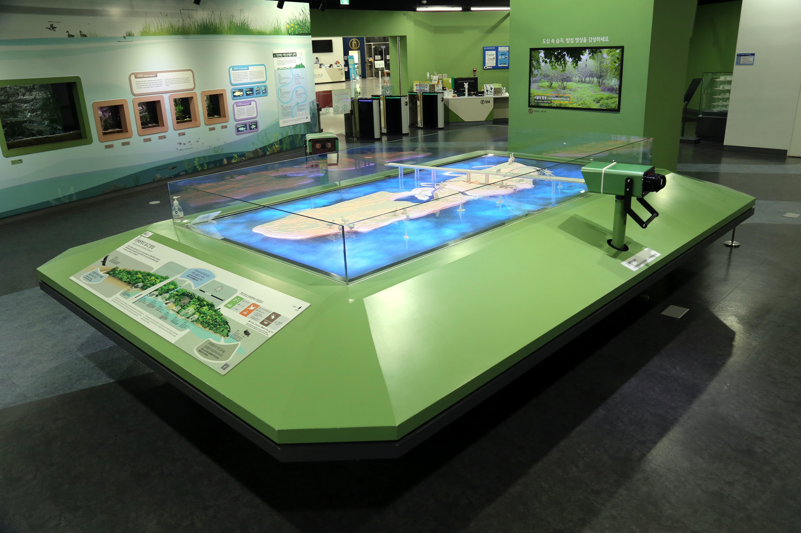

  <button class="nav-btn" onclick="goHome()">🏠 홈</button>
  <button class="nav-btn" onclick="goHall('green')">🟢 Green 전시실 개요</button>
  <button class="nav-btn" onclick="goBack()">⬅ 이전 페이지</button>

# G06 생태계의 보고 밤섬

## 1. 전시물 기본 내용
### 1.1 전시물 이미지

  
전시 목적

  

    밤섬의 축소 모형과 조류 및 밤섬 정보영상을 통해 밤섬의 역사와 밤섬의 생태적 특성을 살려본다. 스코프비전으로 밤섬에서 서식하는 조류의 영상을 관찰하면서 특징을 이해한다.
  

  
전시 유형 : 체험형

  

    스코프비전을 이용해 밤섬의 조류를 관찰해보는 체험이 있는 전시물.
  

### 1.2 학교 교육과정  
<!--
curriculum-table은 전시물과 연결된 학교 교육과정을 학년별로 비교하는 표이다.
내용체계 칸에는 정적 웹에 포함된 내부 교육과정 문서 링크를 넣는다.
챕터 및 단원명 칸에는 외부 교과서/교과 챕터 링크를 넣는다.
전시물과 연계성 칸에는 전시물에서 어떤 개념과 연결되는지 적는다.
비고 칸에는 학년별 수준 변화, 해설 시 유의점, 확인이 필요한 내용을 적는다.
-->

<table class="curriculum-table">
  <caption><b>학교 교육과정</b></caption>
  <thead>
    <tr>
      <th rowspan="2">교육과정 내용체계</th>
      <th colspan="2">해당 교과과정(교과서)</th>
      <th rowspan="2">전시물과 연계성</th>
      <th rowspan="2">비고</th>
    </tr>
    <tr>
      <th>학년 및 학기</th>
      <th>챕터 및 단원명</th>
    </tr>
  </thead>
  <tfoot>
    <tr>
      <td colspan="5">
        <ul>
          <li>교과챕터 및 단원명은 출판사의 교과서 pdf링크로 연결됩니다.</li>
          <li>고등2~3학년 과정은 선택교과입니다.</li>
        </ul>
      </td>
    </tr>
  </tfoot>
  <tbody>
    <tr>
          <td>
            <a class="curriculum-link-button" href="#/docs/school_curriculum/science/01_integrated_science">
            통합과학2 &gt; 변화와 다양성
            </a>
          </td>
          <td>고등1학년</td>
          <td><a class="curriculum-link-button external" href="https://ibook.vivasam.com/CBS_iBook/3784/contents/index.html?skin=basic01" target="_blank" rel="noopener">
                  I-1-02 진화와 생물다양성 (22개정 비상교과서 통합과학2 pp 22-)</a></td>
          <td>생물다양성이 유지되는 안정된 생태계에 대해 생각함</td>
          <td></td>
        </tr>
  </tbody>
</table>

### 1.3 체험
##### 체험1) 밤섬의 생태 살펴보기
1. 밤섬을 연출한 축소 모형을 살펴본다.
2. 패널을 보고 밤섬의 생태적인 특징과 서식하는 주요 동식물에 대해 알아본다.
3. 벽면 영상을 보며 밤섬의 생태적 가치를 이해한다.
4. 스코프비전을 움직여서 밤섬 위에 있는 새 모형에 맞춰보고 해당 새에 대한 정보를 영상과 내레이션으로 확인한다.

### 1.4 패널내용

  

    생태계의 보고 밤섬
  

  

    
  

  

    체험방법
  

  

    
  

## 2. 기본 과학 이론
### 2.1 핵심 과학이론

### 2.2 연관 과학이론

## 3. 연관 전시물

<!--
related-exhibit-link-list는 연관 전시물 문서로 이동하는 버튼 목록이다.
a 태그의 href에는 연결할 전시물 문서 경로를 입력한다.
버튼을 여러 개 넣으면 세로로 정렬된다.

  <a class="related-exhibit-link-button" href="#/docs/halls/blue/B01">B01 세상은 어떻게 연결되어 있을까?</a>

-->

## 4. 기존 해설에서의 쓰임 예시

## 5. 확장 자료

### 심화 이론

<!--
resource-link-list는 확장 자료 링크를 세로로 정렬하는 목록이다.
내부 문서는 href에 #/docs/... 형식의 정적 웹 문서 경로를 입력한다.
버튼을 여러 개 넣으면 세로로 정렬된다.

  <a class="resource-link-button" href="#/docs/theory/zzz_incomplete">이론 양식 문서 보기</a>

-->

### 최신 연구

<!--
resource-link-list는 확장 자료 링크를 세로로 정렬하는 목록이다.
외부 자료는 href에 전체 URL을 입력하고 target="_blank" rel="noopener"를 함께 사용한다.
버튼을 여러 개 넣으면 세로로 정렬된다.

  <a class="resource-link-button external" href="https://www.google.com" target="_blank" rel="noopener">외부 연구 자료 보기</a>

-->

## 변경기록
| 변경일        | 작성자 | 내용 및 사유 |
| ---------- | --- | ------- |
| 2026.01.22 | 박은선 | 최초 작성   |
|            |     |         |

  <button class="nav-btn" onclick="goHome()">🏠 홈</button>
  <button class="nav-btn" onclick="goHall('green')">🟢 Green 전시실 개요</button>
  <button class="nav-btn" onclick="goBack()">⬅ 이전 페이지</button>

