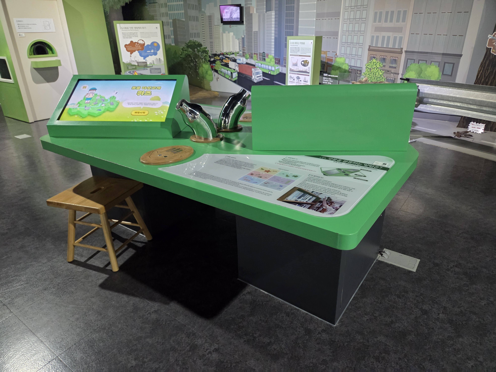

  <button class="nav-btn" onclick="goHome()">🏠 홈</button>
  <button class="nav-btn" onclick="goHall('green')">🟢 Green 전시실 개요</button>
  <button class="nav-btn" onclick="goBack()">⬅ 이전 페이지</button>

# G07 생물을 분류하는 방법은?

## 1. 전시물 기본 내용
### 1.1 전시물 이미지

  
전시 목적

  

    ?
    </ul>
  

  
전시 유형 : 체험형/게임형

  

    스무고개 게임을 진행할 수 있는 터치 모니터로 구성된 전시물
  

### 1.2 학교 교육과정  
<!--
curriculum-table은 전시물과 연결된 학교 교육과정을 학년별로 비교하는 표이다.
내용체계 칸에는 정적 웹에 포함된 내부 교육과정 문서 링크를 넣는다.
챕터 및 단원명 칸에는 외부 교과서/교과 챕터 링크를 넣는다.
전시물과 연계성 칸에는 전시물에서 어떤 개념과 연결되는지 적는다.
비고 칸에는 학년별 수준 변화, 해설 시 유의점, 확인이 필요한 내용을 적는다.
-->

<table class="curriculum-table">
  <caption><b>학교 교육과정</b></caption>
  <thead>
    <tr>
      <th rowspan="2">교육과정 내용체계</th>
      <th colspan="2">해당 교과과정(교과서)</th>
      <th rowspan="2">전시물과 연계성</th>
      <th rowspan="2">비고</th>
    </tr>
    <tr>
      <th>학년 및 학기</th>
      <th>챕터 및 단원명</th>
    </tr>
  </thead>
  <tfoot>
    <tr>
      <td colspan="5">
        <ul>
          <li>교과챕터 및 단원명은 출판사의 교과서 pdf링크로 연결됩니다.</li>
          <li>고등2~3학년 과정은 선택교과입니다.</li>
        </ul>
      </td>
    </tr>
  </tfoot>
  <tbody>
    <tr>
      <td>
        <a class="curriculum-link-button" href="#/docs/school_curriculum/math/common/00_common_math_elementary1-2">
        초등학교 1~2학년 &gt; 자료와 가능성 &gt; 자료의 분류
        </a>
      </td>
      <td></td>
      <td></td>
      <td>생물 분류 스무고개 하기 활동 과정에서 자료를 수량화하고 가능성을 비교하거나 표와 그래프로 해석하는 방법을 이해함</td>
      <td></td>
    </tr>
    <tr>
      <td>
        <a class="curriculum-link-button" href="#/docs/school_curriculum/science/common/00_common_science_elementry3-4">
          초등학교 3~4학년 &gt; 동물의 생활
        </a>
      </td>
      <td>초등3-1</td>
      <td><a class="curriculum-link-button external" href="https://s3.ap-northeast-2.amazonaws.com/tsol.jihak.co.kr/tsol/22tp/e/sci/JIHAKSA_%EA%B3%BC%ED%95%99_%EC%B4%88_3-1_%EA%B5%90%EA%B3%BC%EC%84%9C.pdf" target="_blank" rel="noopener">
          2. 동물의 생활 (22개정 지학사 과학 3-1 pp 43~65)</a></td>
      <td>동물의 생김세와 생태에 대한 내용</td>
      <td></td>
    </tr>
    <tr>
      <td>
        <a class="curriculum-link-button" href="#/docs/school_curriculum/science/common/00_common_science_elementry3-4">
          초등학교 3~4학년 &gt; 생물의 한살이
        </a>
      </td>
      <td>초등3-1</td>
      <td><a class="curriculum-link-button external" href="https://s3.ap-northeast-2.amazonaws.com/tsol.jihak.co.kr/tsol/22tp/e/sci/JIHAKSA_%EA%B3%BC%ED%95%99_%EC%B4%88_3-1_%EA%B5%90%EA%B3%BC%EC%84%9C.pdf" target="_blank" rel="noopener">
          4. 생물의 한살이 (22개정 지학사 과학 3-1 pp 96~108)</a></td>
      <td>생물의 분류 과정에서 일부 생물의 성장 과정에서의 변화가 포함됨</td>
      <td></td>
    </tr>
    <tr>
      <td>
        <a class="curriculum-link-button" href="#/docs/school_curriculum/science/common/00_common_science_mid">
        중학교 1~3학년 &gt; 생물의 구성과 다양성
        </a>
      </td>
      <td>중등1학년</td>
      <td><a class="curriculum-link-button external" href="https://s3.ap-northeast-2.amazonaws.com/tsol.jihak.co.kr/tsol/22tp/m/sci/JIHAKSA_%EA%B3%BC%ED%95%991_%EC%A4%91_%EA%B5%90%EA%B3%BC%EC%84%9C.pdf" target="_blank" rel="noopener">
          II-2-02 생물의 분류 (22개정 지학사 중등1 pp 58-63)</a></td>
      <td>생물분류체계에 대해 알아봄</td>
      <td></td>
    </tr>
    <tr>
      <td>
        <a class="curriculum-link-button" href="#/docs/school_curriculum/science/01_integrated_science">
          통합과학2 &gt; 변화와 다양성
        </a>
      </td>
      <td></td>
      <td></td>
      <td>생물 분류 스무고개 하기 활동 과정에서 생명체의 공통점과 다양성 및 환경에 따른 변화 과정을 이해함</td>
      <td></td>
    </tr>
    <tr>
      <td>
        <a class="curriculum-link-button" href="#/docs/school_curriculum/science/05_life_science">
        생명과학 &gt; 생명의 연속성과 다양성
        </a>
      </td>
      <td></td>
      <td></td>
      <td>생물 분류 스무고개 하기 활동 과정에서 생명체의 구조와 기능 및 생명 현상이 유지되는 원리를 이해함</td>
      <td></td>
    </tr>
    <tr>
      <td>
        <a class="curriculum-link-button" href="#/docs/school_curriculum/science/16_climate_change_and_environmental_ecology">
        기후변화와 환경생태 &gt; 기후와 환경생태의 특성
        </a>
      </td>
      <td></td>
      <td></td>
      <td>생물 분류 스무고개 하기 활동 과정에서 인간 활동과 환경 변화의 관계를 살펴보고 지속가능한 해결 방법을 생각함</td>
      <td></td>
    </tr>
  </tbody>
</table>

### 1.3 체험
##### 체험1) 생물 분류 스무고개 하기
1. 혼자, 또는 대결상대와 짝을 이루어 의자에 앉는다.
2. 터치 모니터의 [시작하기]버튼을 누른 후, 안내에 따라 게임을 체험한다.
3. 둘이서 대결하는 경우 합의에 따라 '전기 발생장치'도 활용해본다.  <a style="color:red"> ※ 문제를 틀리거나 대결에서 지면 벌칙 바람을 맞게 된다. </a>

### 1.4 패널내용

  

    생물을 분류하는 방법은?
  

  

    
  

## 2. 기본 과학 이론
### 2.1 핵심 과학이론

<!--
data-theories에는 연결할 이론 문서의 제목을 입력한다.
쉼표(,)로 여러 이론을 구분할 수 있으며, assets/js/theory-links.js에 등록된 제목과 일치하면 버튼형 링크로 표시된다.
등록되지 않은 제목은 비활성 표시로 나타난다.
-->

### 2.2 연관 과학이론

## 3. 연관 전시물

<!--
related-exhibit-link-list는 연관 전시물 문서로 이동하는 버튼 목록이다.
a 태그의 href에는 연결할 전시물 문서 경로를 입력한다.
버튼을 여러 개 넣으면 세로로 정렬된다.

  <a class="related-exhibit-link-button" href="#/docs/halls/blue/B01">B01 세상은 어떻게 연결되어 있을까?</a>

-->

## 4. 기존 해설에서의 쓰임 예시

## 5. 확장 자료

### 심화 이론

<!--
resource-link-list는 확장 자료 링크를 세로로 정렬하는 목록이다.
내부 문서는 href에 #/docs/... 형식의 정적 웹 문서 경로를 입력한다.
버튼을 여러 개 넣으면 세로로 정렬된다.

  <a class="resource-link-button" href="#/docs/theory/zzz_incomplete">이론 양식 문서 보기</a>

-->

### 최신 연구

<!--
resource-link-list는 확장 자료 링크를 세로로 정렬하는 목록이다.
외부 자료는 href에 전체 URL을 입력하고 target="_blank" rel="noopener"를 함께 사용한다.
버튼을 여러 개 넣으면 세로로 정렬된다.

  <a class="resource-link-button external" href="https://www.google.com" target="_blank" rel="noopener">외부 연구 자료 보기</a>

-->

## 변경기록
| 변경일        | 작성자 | 내용 및 사유 |
| ---------- | --- | ------- |
| 2026.01.22 | 박은선 | 최초 작성   |
|            |     |         |

  <button class="nav-btn" onclick="goHome()">🏠 홈</button>
  <button class="nav-btn" onclick="goHall('green')">🟢 Green 전시실 개요</button>
  <button class="nav-btn" onclick="goBack()">⬅ 이전 페이지</button>

