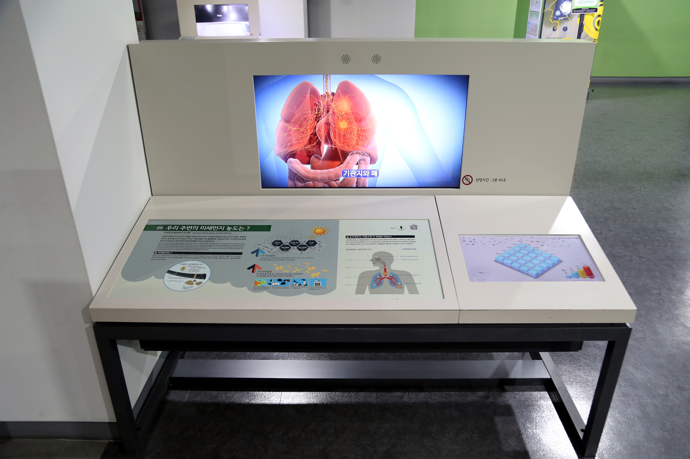

  <button class="nav-btn" onclick="goHome()">🏠 홈</button>
  <button class="nav-btn" onclick="goHall('green')">🟢 Green 전시실 개요</button>
  <button class="nav-btn" onclick="goBack()">⬅ 이전 페이지</button>

# G11 우리가 사는 땅은 어떻게 형성되었을까?

## 1. 전시물 기본 내용
### 1.1 전시물 이미지

  
전시 목적

  

    서울의 지형 형성 과정을 알아보고, 산으로 둘러싸인 서울의 지질학적 특성을 이해한다. 또한, 한반도의 지질 구조 변화에 따른 시기별 주요 암석을 확인한다. 이를 통해, 지형을 이루는 구성 요소를 알아본다.
  

  
전시 유형 : 체험형

  

    모래를 이용하여 서울 지형을 만들어보고, 등고선 변화를 관찰하는 전시물
  

### 1.2 학교 교육과정  
<!--
curriculum-table은 전시물과 연결된 학교 교육과정을 학년별로 비교하는 표이다.
내용체계 칸에는 정적 웹에 포함된 내부 교육과정 문서 링크를 넣는다.
챕터 및 단원명 칸에는 외부 교과서/교과 챕터 링크를 넣는다.
전시물과 연계성 칸에는 전시물에서 어떤 개념과 연결되는지 적는다.
비고 칸에는 학년별 수준 변화, 해설 시 유의점, 확인이 필요한 내용을 적는다.
-->

<table class="curriculum-table">
  <caption><b>학교 교육과정</b></caption>
  <thead>
    <tr>
      <th rowspan="2">교육과정 내용체계</th>
      <th colspan="2">해당 교과과정(교과서)</th>
      <th rowspan="2">전시물과 연계성</th>
      <th rowspan="2">비고</th>
    </tr>
    <tr>
      <th>학년 및 학기</th>
      <th>챕터 및 단원명</th>
    </tr>
  </thead>
  <tfoot>
    <tr>
      <td colspan="5">
        <ul>
          <li>교과챕터 및 단원명은 출판사의 교과서 pdf링크로 연결됩니다.</li>
          <li>고등2~3학년 과정은 선택교과입니다.</li>
        </ul>
      </td>
    </tr>
  </tfoot>
  <tbody>
    <tr>
      <td>
      </td>
      <td>1학년 1학기</td>
      <td>
        <a class="curriculum-link-button external" href="https://example.com" target="_blank" rel="noopener">
          교과 챕터 링크예시
        </a>
      </td>
      <td></td>
      <td>비고</td>
    </tr>
    <tr>
      <td>
        <a class="curriculum-link-button" href="#/docs/school_curriculum/science/common/00_common_science_elementry3-4">
          초등학교 3~4학년 &gt; 땅의 변화
        </a>
      </td>
      <td>초등4-1</td>
      <td><a class="curriculum-link-button external" href="https://s3.ap-northeast-2.amazonaws.com/tsol.jihak.co.kr/tsol/22tp/e/sci/JIHAKSA_%EA%B3%BC%ED%95%99_%EC%B4%88_4-1_%EA%B5%90%EA%B3%BC%EC%84%9C.pdf" target="_blank" rel="noopener">
          3. 땅의 변화 (22개정 지학사 과학 4-1 pp 72-91)</a></td>
      <td>체험용 모래와 영상으로 서울의 지형 만들기 활동 과정에서 지권의 구성과 변화 및 지구 환경 요소의 상호작용을 이해함</td>
      <td>물의 침식작용에 대해 학습함</td>
    </tr>
    <tr>
      <td>
        <a class="curriculum-link-button" href="#/docs/school_curriculum/science/common/00_common_science_elementry5-6">
          초등학교 5~6학년 &gt; 지층과 화석
        </a>
      </td>
      <td>초등5-1</td>
      <td><a class="curriculum-link-button external" href="https://wbook.jihak.co.kr/SynapDocViewServer/viewer/doc.html?key=9fddc34069f6464c88e119b0154ab910&convType=img&convLocale=ko_KR&contextPath=/SynapDocViewServer" target="_blank" rel="noopener">
          1. 지층과 화석 (22개정 지학사 과학 5-1 pp 18-33)</a></td>
      <td>체험용 모래와 영상으로 서울의 지형 만들기 활동 과정에서 지권의 구성과 변화 및 지구 환경 요소의 상호작용을 이해함</td>
      <td></td>
    </tr>
    <tr>
      <td>
        <a class="curriculum-link-button" href="#/docs/school_curriculum/science/common/00_common_science_mid">
          중학교 1~3학년 &gt; 지권의 변화
        </a>
      </td>
      <td></td>
      <td></td>
      <td>체험용 모래와 영상으로 서울의 지형 만들기 활동 과정에서 지권의 구성과 변화 및 지구 환경 요소의 상호작용을 이해함</td>
      <td></td>
    </tr>
    <tr>
      <td>
        <a class="curriculum-link-button" href="#/docs/school_curriculum/science/01_integrated_science">
          통합과학1 &gt; 시스템과 상호작용
        </a>
      </td>
      <td></td>
      <td></td>
      <td>체험용 모래와 영상으로 서울의 지형 만들기 활동 과정에서 구성 요소 사이의 관계와 상호작용으로 자연 현상을 설명함</td>
      <td></td>
    </tr>
    <tr>
      <td>
        <a class="curriculum-link-button" href="#/docs/school_curriculum/science/06_earth_science">
        지구과학 &gt; 지구의 역사와 한반도의 암석
        </a>
      </td>
      <td></td>
      <td></td>
      <td>체험용 모래와 영상으로 서울의 지형 만들기 활동 과정에서 지권의 구성과 변화 및 지구 환경 요소의 상호작용을 이해함</td>
      <td></td>
    </tr>
    <tr>
      <td>
        <a class="curriculum-link-button" href="#/docs/school_curriculum/science/13_earth_system_science">
        지구시스템과학 &gt; 지구 탄생과 생동하는 지구
        </a>
      </td>
      <td></td>
      <td></td>
      <td>체험용 모래와 영상으로 서울의 지형 만들기 활동 과정에서 지권의 구성과 변화 및 지구 환경 요소의 상호작용을 이해함</td>
      <td></td>
    </tr>
  </tbody>
</table>

### 1.3 체험
##### 체험1) 체험용 모래와 영상으로 서울의 지형 만들기
1. 모래 위에 있는 모래 긁기로 모래를 평평하게 한다.
2. 산의 등고선과 강의 물줄기를 확인한다.
3. 모래를 파거나 쌓아 지형을 만들어본다.

##### 체험2) 한반도의 지질시대별 형성 과정 확인하기
1. 패널에서 지형의 변화과정, 암석의 종류와 분포를 살펴본다.

### 1.4 패널내용

  

    우리가 사는 땅은 어떻게 변해왔을까?(구)
  

  

    
  

  

    서울의 지형형성
  

  

    
  

## 2. 기본 과학 이론
### 2.1 핵심 과학이론

<!--
data-theories에는 연결할 이론 문서의 제목을 입력한다.
쉼표(,)로 여러 이론을 구분할 수 있으며, assets/js/theory-links.js에 등록된 제목과 일치하면 버튼형 링크로 표시된다.
등록되지 않은 제목은 비활성 표시로 나타난다.
-->

### 2.2 연관 과학이론

## 3. 연관 전시물

<!--
related-exhibit-link-list는 연관 전시물 문서로 이동하는 버튼 목록이다.
a 태그의 href에는 연결할 전시물 문서 경로를 입력한다.
버튼을 여러 개 넣으면 세로로 정렬된다.

  <a class="related-exhibit-link-button" href="#/docs/halls/blue/B01">B01 세상은 어떻게 연결되어 있을까?</a>

-->

## 4. 기존 해설에서의 쓰임 예시

## 5. 확장 자료

### 심화 이론

<!--
resource-link-list는 확장 자료 링크를 세로로 정렬하는 목록이다.
내부 문서는 href에 #/docs/... 형식의 정적 웹 문서 경로를 입력한다.
버튼을 여러 개 넣으면 세로로 정렬된다.

  <a class="resource-link-button" href="#/docs/theory/zzz_incomplete">이론 양식 문서 보기</a>

-->

### 최신 연구

<!--
resource-link-list는 확장 자료 링크를 세로로 정렬하는 목록이다.
외부 자료는 href에 전체 URL을 입력하고 target="_blank" rel="noopener"를 함께 사용한다.
버튼을 여러 개 넣으면 세로로 정렬된다.

  <a class="resource-link-button external" href="https://www.google.com" target="_blank" rel="noopener">외부 연구 자료 보기</a>

-->

<!--
doc-tags는 문서에 해시태그를 표시하는 영역이다.
data-tags에 쉼표로 구분한 태그 이름을 입력한다.
태그 이름에는 #을 직접 붙이지 않는다.

-->

## 변경기록
| 변경일        | 작성자 | 내용 및 사유 |
| ---------- | --- | ------- |
| 2026.01.22 | 박은선 | 최초 작성   |
|            |     |         |

  <button class="nav-btn" onclick="goHome()">🏠 홈</button>
  <button class="nav-btn" onclick="goHall('green')">🟢 Green 전시실 개요</button>
  <button class="nav-btn" onclick="goBack()">⬅ 이전 페이지</button>

