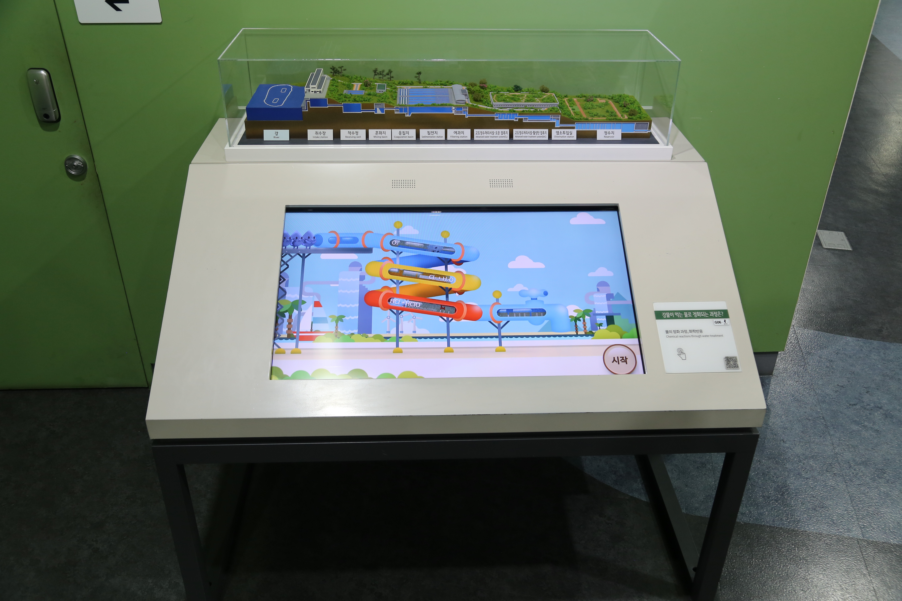

  <button class="nav-btn" onclick="goHome()">🏠 홈</button>
  <button class="nav-btn" onclick="goHall('green')">🟢 Green 전시실 개요</button>
  <button class="nav-btn" onclick="goBack()">⬅ 이전 페이지</button>

# G13 강물이 먹는 물로 정화되는 과정은?

## 1. 전시물 기본 내용
### 1.1 전시물 이미지

  
전시 목적

  

    한강 물의 정수 처리 시설을 단계별로 연출한 모형을 살펴본다. 단계별로 작용하는 과학적 원리를 퀴즈 영상으로 풀어보면서, 각 과정에서 일어나는 화학적인 반응을 이해한다.
  

  
전시 유형 : 관람형

  

    디오라마와 터치 모니터로 구성되어있는 전시물
  

### 1.2 학교 교육과정  
<!--
curriculum-table은 전시물과 연결된 학교 교육과정을 학년별로 비교하는 표이다.
내용체계 칸에는 정적 웹에 포함된 내부 교육과정 문서 링크를 넣는다.
챕터 및 단원명 칸에는 외부 교과서/교과 챕터 링크를 넣는다.
전시물과 연계성 칸에는 전시물에서 어떤 개념과 연결되는지 적는다.
비고 칸에는 학년별 수준 변화, 해설 시 유의점, 확인이 필요한 내용을 적는다.
-->

<table class="curriculum-table">
  <caption><b>학교 교육과정</b></caption>
  <thead>
    <tr>
      <td>
        <a class="curriculum-link-button" href="#/docs/school_curriculum/science/04_chemistry">
        화학 &gt; 역동적인 화학 반응
        </a>
      </td>
      <td></td>
      <td></td>
      <td>정수 처리시설의 단계별 기능과 과학 원리 이해하기 활동 과정에서 물질의 성질과 구조, 변화 과정에서 나타나는 현상을 관찰하고 이해함</td>
      <td></td>
    </tr>
    <tr>
      <td>
        <a class="curriculum-link-button" href="#/docs/school_curriculum/science/09_matter_and_energy">
        물질과 에너지 &gt; 용액의 성질
        </a>
      </td>
      <td></td>
      <td></td>
      <td>정수 처리시설의 단계별 기능과 과학 원리 이해하기 활동 과정에서 물질의 성질과 구조, 변화 과정에서 나타나는 현상을 관찰하고 이해함</td>
      <td></td>
    </tr>
    <tr>
      <td>
        <a class="curriculum-link-button" href="#/docs/school_curriculum/science/10_world_of_chemical_reactions">
        화학 반응의 세계 &gt; 산 염기 평형
        </a>
      </td>
      <td></td>
      <td></td>
      <td>정수 처리시설의 단계별 기능과 과학 원리 이해하기 활동 과정에서 물질의 성질과 구조, 변화 과정에서 나타나는 현상을 관찰하고 이해함</td>
      <td></td>
    </tr>
    <tr>
      <td>
        <a class="curriculum-link-button" href="#/docs/school_curriculum/science/13_earth_system_science">
        지구시스템과학 &gt; 해수의 운동
        </a>
      </td>
      <td></td>
      <td></td>
      <td>정수 처리시설의 단계별 기능과 과학 원리 이해하기 활동 과정에서 힘과 운동의 관계 및 에너지의 전달과 전환을 실제 현상에 적용해 이해함</td>
      <td></td>
    </tr>
  </tbody>
</table>

### 1.3 체험
##### 체험1) 정수 처리시설의 단계별 기능과 과학 원리 이해하기
1. 한강 물의 정수 처리 시설 모형을 살펴본다.
2. 터지 화면에서 정수 처리 과정 영상을 보며 퀴즈를 푼다.
3. 정수 처리 시설의 단계별 기능과 과학 원리 이해하기

### 1.4 패널내용
(패널없음)
<!--

  

    패널 타이틀
  

  

    
  

-->

## 2. 기본 과학 이론
### 2.1 핵심 과학이론

<!--
data-theories에는 연결할 이론 문서의 제목을 입력한다.
쉼표(,)로 여러 이론을 구분할 수 있으며, assets/js/theory-links.js에 등록된 제목과 일치하면 버튼형 링크로 표시된다.
등록되지 않은 제목은 비활성 표시로 나타난다.
-->

### 2.2 연관 과학이론

## 3. 연관 전시물

<!--
related-exhibit-link-list는 연관 전시물 문서로 이동하는 버튼 목록이다.
a 태그의 href에는 연결할 전시물 문서 경로를 입력한다.
버튼을 여러 개 넣으면 세로로 정렬된다.

  <a class="related-exhibit-link-button" href="#/docs/halls/blue/B01">B01 세상은 어떻게 연결되어 있을까?</a>

-->

## 4. 기존 해설에서의 쓰임 예시

## 5. 확장 자료

### 심화 이론

<!--
resource-link-list는 확장 자료 링크를 세로로 정렬하는 목록이다.
내부 문서는 href에 #/docs/... 형식의 정적 웹 문서 경로를 입력한다.
버튼을 여러 개 넣으면 세로로 정렬된다.

  <a class="resource-link-button" href="#/docs/theory/zzz_incomplete">이론 양식 문서 보기</a>

-->

### 최신 연구

<!--
resource-link-list는 확장 자료 링크를 세로로 정렬하는 목록이다.
외부 자료는 href에 전체 URL을 입력하고 target="_blank" rel="noopener"를 함께 사용한다.
버튼을 여러 개 넣으면 세로로 정렬된다.

  <a class="resource-link-button external" href="https://www.google.com" target="_blank" rel="noopener">외부 연구 자료 보기</a>

-->

<!--
doc-tags는 문서에 해시태그를 표시하는 영역이다.
data-tags에 쉼표로 구분한 태그 이름을 입력한다.
태그 이름에는 #을 직접 붙이지 않는다.

-->

## 변경기록
| 변경일        | 작성자 | 내용 및 사유 |
| ---------- | --- | ------- |
| 2026.01.22 | 박은선 | 최초 작성   |
|            |     |         |

  <button class="nav-btn" onclick="goHome()">🏠 홈</button>
  <button class="nav-btn" onclick="goHall('green')">🟢 Green 전시실 개요</button>
  <button class="nav-btn" onclick="goBack()">⬅ 이전 페이지</button>

