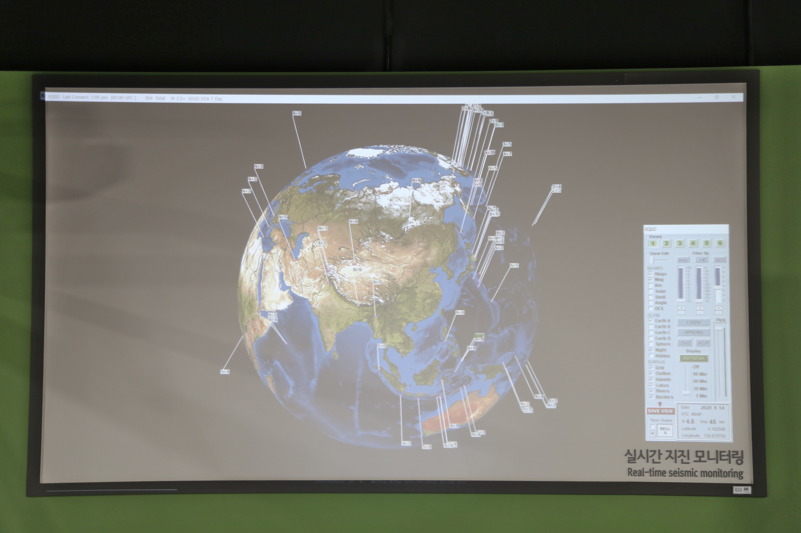

  <button class="nav-btn" onclick="goHome()">🏠 홈</button>
  <button class="nav-btn" onclick="goHall('green')">🟢 Green 전시실 개요</button>
  <button class="nav-btn" onclick="goBack()">⬅ 이전 페이지</button>

# G18 도시의 기온이 더 높은 이유는 무엇일까?

## 1. 전시물 기본 내용
### 1.1 전시물 이미지

  
전시 목적

  

    ‘양재역’과 ‘양재시민의 숲’을 열화상 카메라로 실제 촬영해온 영상을 보면서, 열섬현상과 냉섬현상의 발생 원인을 알아본다. 녹지 및 도심의 온도 차이와 열전도율과의 상관관계, 열화상 카메라의 원리 및 사용 사례 등을 그래픽 패널로 알아본다.
  

  
전시 유형 : 체험형

  

    터치 모니터와 아날로그 패널이 있는 전시물
  

### 1.2 학교 교육과정  
<!--
curriculum-table은 전시물과 연결된 학교 교육과정을 학년별로 비교하는 표이다.
내용체계 칸에는 정적 웹에 포함된 내부 교육과정 문서 링크를 넣는다.
챕터 및 단원명 칸에는 외부 교과서/교과 챕터 링크를 넣는다.
전시물과 연계성 칸에는 전시물에서 어떤 개념과 연결되는지 적는다.
비고 칸에는 학년별 수준 변화, 해설 시 유의점, 확인이 필요한 내용을 적는다.
-->

<table class="curriculum-table">
  <caption><b>학교 교육과정</b></caption>
  <thead>
    <tr>
      <th rowspan="2">교육과정 내용체계</th>
      <th colspan="2">해당 교과과정(교과서)</th>
      <th rowspan="2">전시물과 연계성</th>
      <th rowspan="2">비고</th>
    </tr>
    <tr>
      <th>학년 및 학기</th>
      <th>챕터 및 단원명</th>
    </tr>
  </thead>
  <tfoot>
    <tr>
      <td colspan="5">
        <ul>
          <li>교과챕터 및 단원명은 출판사의 교과서 pdf링크로 연결됩니다.</li>
          <li>고등2~3학년 과정은 선택교과입니다.</li>
        </ul>
      </td>
    </tr>
  </tfoot>
  <tbody>
    <tr>
      <td>
      </td>
      <td>1학년 1학기</td>
      <td>
        <a class="curriculum-link-button external" href="https://example.com" target="_blank" rel="noopener">
          교과 챕터 링크예시
        </a>
      </td>
      <td></td>
      <td>비고</td>
    </tr>
    <tr>
      <td>
        <a class="curriculum-link-button" href="#/docs/school_curriculum/science/common/00_common_science_elementry3-4">
          초등학교 3~4학년 &gt; 물의 상태 변화
        </a>
      </td>
      <td>초등4-1</td>
      <td><a class="curriculum-link-button external" href="https://s3.ap-northeast-2.amazonaws.com/tsol.jihak.co.kr/tsol/22tp/e/sci/JIHAKSA_%EA%B3%BC%ED%95%99_%EC%B4%88_4-1_%EA%B5%90%EA%B3%BC%EC%84%9C.pdf" target="_blank" rel="noopener">
          2. 물의 상태 변화 (22개정 지학사 과학 4-1 pp 44-59)</a></td>
      <td>양재역과 양재시민의 숲 촬영 영상 활동 과정에서 물질의 성질과 구조, 변화 과정에서 나타나는 현상을 관찰하고 이해함</td>
      <td></td>
    </tr>
    <tr>
      <td>
        <a class="curriculum-link-button" href="#/docs/school_curriculum/math/common/00_common_math_elementary3-4">
        초등학교 3~4학년 &gt; 자료와 가능성 &gt; 그래프
        </a>
      </td>
      <td></td>
      <td></td>
      <td>양재역과 양재시민의 숲 촬영 영상 활동 과정에서 자료와 변화를 수량화하고 표나 그래프로 해석하는 방법을 이해함</td>
      <td></td>
    </tr>
    <tr>
      <td>
        <a class="curriculum-link-button" href="#/docs/school_curriculum/science/common/00_common_science_mid">
        중학교 1~3학년 &gt; 열
        </a>
      </td>
      <td></td>
      <td></td>
      <td>양재역과 양재시민의 숲 촬영 영상 활동 과정에서 열의 이동과 온도 변화가 물질과 생활에 미치는 영향을 관찰하고 이해함</td>
      <td></td>
    </tr>
    <tr>
      <td>
        <a class="curriculum-link-button" href="#/docs/school_curriculum/science/common/00_common_science_mid">
        중학교 1~3학년 &gt; 물질의 상태 변화
        </a>
      </td>
      <td></td>
      <td></td>
      <td>양재역과 양재시민의 숲 촬영 영상 활동 과정에서 물질의 성질과 구조, 변화 과정에서 나타나는 현상을 관찰하고 이해함</td>
      <td></td>
    </tr>
    <tr>
      <td>
        <a class="curriculum-link-button" href="#/docs/school_curriculum/science/common/00_common_science_mid">
        중학교 1~3학년 &gt; 날씨와 기후변화
        </a>
      </td>
      <td></td>
      <td></td>
      <td>양재역과 양재시민의 숲 촬영 영상 활동 과정에서 대기와 해양에서 나타나는 현상 및 날씨와 기후의 변화를 이해함</td>
      <td></td>
    </tr>
    <tr>
      <td>
        <a class="curriculum-link-button" href="#/docs/school_curriculum/math/common/00_common_math_mid">
        중학교 1~3학년 &gt; 변화와 관계 &gt; 그래프
        </a>
      </td>
      <td></td>
      <td></td>
      <td>양재역과 양재시민의 숲 촬영 영상 활동 과정에서 자료와 변화를 수량화하고 표나 그래프로 해석하는 방법을 이해함</td>
      <td></td>
    </tr>
    <tr>
      <td>
        <a class="curriculum-link-button" href="#/docs/school_curriculum/math/common/00_common_math_mid">
        중학교 1~3학년 &gt; 자료와 가능성
        </a>
      </td>
      <td></td>
      <td></td>
      <td>양재역과 양재시민의 숲 촬영 영상 활동 과정에서 자료를 수량화하고 가능성을 비교하거나 표와 그래프로 해석하는 방법을 이해함</td>
      <td></td>
    </tr>
    <tr>
      <td>
        <a class="curriculum-link-button" href="#/docs/school_curriculum/science/01_integrated_science">
          통합과학2 &gt; 환경과 에너지
        </a>
      </td>
      <td></td>
      <td></td>
      <td>양재역과 양재시민의 숲 촬영 영상 활동 과정에서 인간 활동과 환경 변화의 관계를 살펴보고 지속가능한 해결 방법을 생각함</td>
      <td></td>
    </tr>
    <tr>
      <td>
        <a class="curriculum-link-button" href="#/docs/school_curriculum/science/06_earth_science">
        지구과학 &gt; 대기와 해양의 상호작용
        </a>
      </td>
      <td></td>
      <td></td>
      <td>양재역과 양재시민의 숲 촬영 영상 활동 과정에서 대기와 해양에서 나타나는 현상 및 날씨와 기후의 변화를 이해함</td>
      <td></td>
    </tr>
    <tr>
      <td>
        <a class="curriculum-link-button" href="#/docs/school_curriculum/science/07_mechanics_and_energy">
        역학과 에너지 &gt; 열과 에너지
        </a>
      </td>
      <td></td>
      <td></td>
      <td>양재역과 양재시민의 숲 촬영 영상 활동 과정에서 열의 이동과 온도 변화가 물질과 생활에 미치는 영향을 관찰하고 이해함</td>
      <td></td>
    </tr>
    <tr>
      <td>
        <a class="curriculum-link-button" href="#/docs/school_curriculum/science/13_earth_system_science">
        지구시스템과학 &gt; 강수 과정과 대기의 운동
        </a>
      </td>
      <td></td>
      <td></td>
      <td>양재역과 양재시민의 숲 촬영 영상 활동 과정에서 대기와 해양에서 나타나는 현상 및 날씨와 기후의 변화를 이해함</td>
      <td></td>
    </tr>
    <tr>
      <td>
        <a class="curriculum-link-button" href="#/docs/school_curriculum/science/16_climate_change_and_environmental_ecology">
        기후변화와 환경생태 &gt; 기후위기와 환경생태 변화
        </a>
      </td>
      <td></td>
      <td></td>
      <td>양재역과 양재시민의 숲 촬영 영상 활동 과정에서 인간 활동과 환경 변화의 관계를 살펴보고 지속가능한 해결 방법을 생각함</td>
      <td></td>
    </tr>
    <tr>
      <td>
        <a class="curriculum-link-button" href="#/docs/school_curriculum/math/12_practical_statistics">
        실용 통계 &gt; 자료의 표현과 요약
        </a>
      </td>
      <td></td>
      <td></td>
      <td>양재역과 양재시민의 숲 촬영 영상 활동 과정에서 자료를 수량화하고 가능성을 비교하거나 표와 그래프로 해석하는 방법을 이해함</td>
      <td></td>
    </tr>
  </tbody>
</table>

### 1.3 체험
##### 체험1) 양재역과 양재시민의 숲 촬영 영상 확인하기
1. 터치 화면에서 열섬현상 또는 냉섬현상을 선택해 양재역과 양재시민의 숲 영상을 확인한다
2. 열감지 영상 버튼을 눌러 영상을 전환한다.
3. 좌, 우 버튼을 이용해 원하는 방향을 살펴본다.
4. 온도계 모양을 눌러 각 대상의 온도를 확인한다.

##### 체험2) 열섬·냉섬 현상 원인 알아보기
1. 터치 화면에서 열섬현상을 누른 후 열섬원인을 누른다.
2. 화면에 나오는 애니메이션을 통해 열섬현상의 발생원인을 알아본다.
3. 같은 방법으로 냉섬현상의 발생 원인을 알아본다.

### 1.4 패널내용

  

    도시의 기온이 더 높은 이유는 무엇일까?
  

  

    
  

## 2. 기본 과학 이론
### 2.1 핵심 과학이론

<!--
data-theories에는 연결할 이론 문서의 제목을 입력한다.
쉼표(,)로 여러 이론을 구분할 수 있으며, assets/js/theory-links.js에 등록된 제목과 일치하면 버튼형 링크로 표시된다.
등록되지 않은 제목은 비활성 표시로 나타난다.
-->

### 2.2 연관 과학이론

## 3. 연관 전시물

<!--
related-exhibit-link-list는 연관 전시물 문서로 이동하는 버튼 목록이다.
a 태그의 href에는 연결할 전시물 문서 경로를 입력한다.
버튼을 여러 개 넣으면 세로로 정렬된다.
-->

  <a class="related-exhibit-link-button" href="#/docs/halls/blue/B01">B01 세상은 어떻게 연결되어 있을까?</a>

## 4. 기존 해설에서의 쓰임 예시

## 5. 확장 자료

### 심화 이론

<!--
resource-link-list는 확장 자료 링크를 세로로 정렬하는 목록이다.
내부 문서는 href에 #/docs/... 형식의 정적 웹 문서 경로를 입력한다.
버튼을 여러 개 넣으면 세로로 정렬된다.

  <a class="resource-link-button" href="#/docs/theory/zzz_incomplete">이론 양식 문서 보기</a>

-->

### 최신 연구

<!--
resource-link-list는 확장 자료 링크를 세로로 정렬하는 목록이다.
외부 자료는 href에 전체 URL을 입력하고 target="_blank" rel="noopener"를 함께 사용한다.
버튼을 여러 개 넣으면 세로로 정렬된다.

  <a class="resource-link-button external" href="https://www.google.com" target="_blank" rel="noopener">외부 연구 자료 보기</a>

-->

<!--
doc-tags는 문서에 해시태그를 표시하는 영역이다.
data-tags에 쉼표로 구분한 태그 이름을 입력한다.
태그 이름에는 #을 직접 붙이지 않는다.

-->

## 변경기록
| 변경일        | 작성자 | 내용 및 사유 |
| ---------- | --- | ------- |
| 2026.01.22 | 박은선 | 최초 작성   |
|            |     |         |

  <button class="nav-btn" onclick="goHome()">🏠 홈</button>
  <button class="nav-btn" onclick="goHall('green')">🟢 Green 전시실 개요</button>
  <button class="nav-btn" onclick="goBack()">⬅ 이전 페이지</button>

