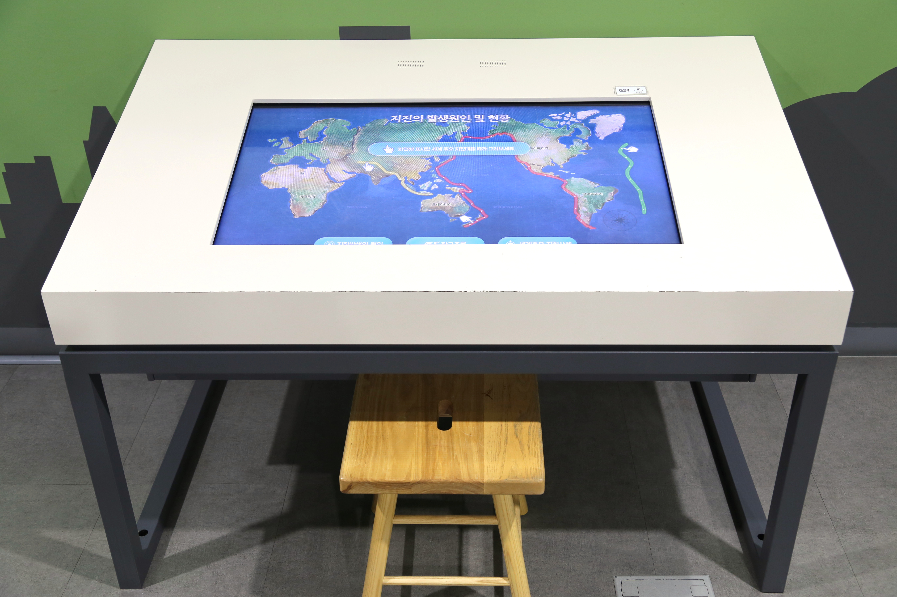

  <button class="nav-btn" onclick="goHome()">🏠 홈</button>
  <button class="nav-btn" onclick="goHall('green')">🟢 Green 전시실 개요</button>
  <button class="nav-btn" onclick="goBack()">⬅ 이전 페이지</button>

# G19 우리 주변의 미세먼지 농도는?

## 1. 전시물 기본 내용
### 1.1 전시물 이미지

  
전시 목적

  

    미세먼지의 개념과 발생 원인을 알아보고, 서울의 실시간 미세먼지 농도 데이터를 통해, 지역별 미세먼지 농도 현황을 확인한다. 또한, 미세먼지가 인체에 미치는 영향을 영상으로 살펴본다.
  

  
전시 유형 : 관람형

  

    디지털 영상을 통해 미세먼지에 대한 정보를 확인하는 전시물
  

### 1.2 학교 교육과정  
<!--
curriculum-table은 전시물과 연결된 학교 교육과정을 학년별로 비교하는 표이다.
내용체계 칸에는 정적 웹에 포함된 내부 교육과정 문서 링크를 넣는다.
챕터 및 단원명 칸에는 외부 교과서/교과 챕터 링크를 넣는다.
전시물과 연계성 칸에는 전시물에서 어떤 개념과 연결되는지 적는다.
비고 칸에는 학년별 수준 변화, 해설 시 유의점, 확인이 필요한 내용을 적는다.
-->

<table class="curriculum-table">
  <caption><b>학교 교육과정</b></caption>
  <thead>
    <tr>
      <th rowspan="2">교육과정 내용체계</th>
      <th colspan="2">해당 교과과정(교과서)</th>
      <th rowspan="2">전시물과 연계성</th>
      <th rowspan="2">비고</th>
    </tr>
    <tr>
      <th>학년 및 학기</th>
      <th>챕터 및 단원명</th>
    </tr>
  </thead>
  <tfoot>
    <tr>
      <td colspan="5">
        <ul>
          <li>교과챕터 및 단원명은 출판사의 교과서 pdf링크로 연결됩니다.</li>
          <li>고등2~3학년 과정은 선택교과입니다.</li>
        </ul>
      </td>
    </tr>
  </tfoot>
  <tbody>
    <tr>
          <td>
            <a class="curriculum-link-button" href="#/docs/school_curriculum/math/common/00_common_math_elementary3-4">
            초등학교 3~4학년 &gt; 자료와 가능성 &gt; 그래프
            </a>
          </td>
          <td></td>
          <td></td>
          <td>미세먼지의 정의와 발생 원인 활동 과정에서 자료와 변화를 수량화하고 표나 그래프로 해석하는 방법을 이해함</td>
          <td></td>
        </tr>
    <tr>
          <td>
            <a class="curriculum-link-button" href="#/docs/school_curriculum/math/common/00_common_math_elementary5-6">
            초등학교 5~6학년 &gt; 자료와 가능성 &gt; 평균과 그래프
            </a>
          </td>
          <td></td>
          <td></td>
          <td>미세먼지의 정의와 발생 원인 활동 과정에서 자료를 수량화하고 가능성을 비교하거나 표와 그래프로 해석하는 방법을 이해함</td>
          <td></td>
        </tr>
    <tr>
          <td>
            <a class="curriculum-link-button" href="#/docs/school_curriculum/science/02_science_inquiry_experiment">
            과학탐구실험2 &gt; 생활 속의 과학 탐구
            </a>
          </td>
          <td></td>
          <td></td>
          <td>미세먼지의 정의와 발생 원인 활동 과정에서 관찰·측정·분류와 증거를 활용하는 과학 탐구 과정을 이해함</td>
          <td></td>
        </tr>
    <tr>
          <td>
            <a class="curriculum-link-button" href="#/docs/school_curriculum/science/02_science_inquiry_experiment">
            과학탐구실험2 &gt; 미래 사회와 첨단 과학 탐구
            </a>
          </td>
          <td></td>
          <td></td>
          <td>미세먼지의 정의와 발생 원인 활동 과정에서 관찰·측정·분류와 증거를 활용하는 과학 탐구 과정을 이해함</td>
          <td></td>
        </tr>
    <tr>
          <td>
            <a class="curriculum-link-button" href="#/docs/school_curriculum/science/17_convergence_science_inquiry">
            융합과학 탐구 &gt; 융합과학 탐구의 이해
            </a>
          </td>
          <td></td>
          <td></td>
          <td>미세먼지의 정의와 발생 원인 활동 과정에서 관찰·측정·분류와 증거를 활용하는 과학 탐구 과정을 이해함</td>
          <td></td>
        </tr>
    <tr>
          <td>
            <a class="curriculum-link-button" href="#/docs/school_curriculum/science/17_convergence_science_inquiry">
            융합과학 탐구 &gt; 융합과학 탐구의 과정
            </a>
          </td>
          <td></td>
          <td></td>
          <td>미세먼지의 정의와 발생 원인 활동 과정에서 관찰·측정·분류와 증거를 활용하는 과학 탐구 과정을 이해함</td>
          <td></td>
        </tr>
    <tr>
          <td>
            <a class="curriculum-link-button" href="#/docs/school_curriculum/science/17_convergence_science_inquiry">
            융합과학 탐구 &gt; 융합과학 탐구의 전망
            </a>
          </td>
          <td></td>
          <td></td>
          <td>미세먼지의 정의와 발생 원인 활동 과정에서 관찰·측정·분류와 증거를 활용하는 과학 탐구 과정을 이해함</td>
          <td></td>
        </tr>
    <tr>
          <td>
            <a class="curriculum-link-button" href="#/docs/school_curriculum/math/05_probability_and_statistics">
            확률과 통계 &gt; 통계적 추정
            </a>
          </td>
          <td></td>
          <td></td>
          <td>미세먼지의 정의와 발생 원인 활동 과정에서 자료를 수량화하고 가능성을 비교하거나 표와 그래프로 해석하는 방법을 이해함</td>
          <td></td>
        </tr>
    <tr>
          <td>
            <a class="curriculum-link-button" href="#/docs/school_curriculum/math/12_practical_statistics">
            실용 통계 &gt; 자료의 표현과 요약
            </a>
          </td>
          <td></td>
          <td></td>
          <td>미세먼지의 정의와 발생 원인 활동 과정에서 자료를 수량화하고 가능성을 비교하거나 표와 그래프로 해석하는 방법을 이해함</td>
          <td></td>
        </tr>
  </tbody>
</table>

### 1.3 체험
##### 체험1) 미세먼지의 정의와 발생 원인 알아보기
1. 패널에서 미세먼지의 정의, 발생 원인을 확인한다.
2. 인체의 각 기관에서 거를 수 있는 먼지의 크기를 확인한다
3. 미세먼지로 인해 각 기관에서 발생할 수 있는 질병을 확인한다.

##### 체험2) 서울의 지역별 실시간 미세먼지와 초미세먼지 농도 데이터 관찰하기
1. 테이블 위 영상에서 서울시 각 구의 미세먼지, 초미세먼지 미세먼지 농도를 확인한다.
2. 우측 하단의 초미세먼지 행동요령 범례를 확인한다.

##### 체험3) 미세먼지가 인체에 미치는 영향 이해하기
1. 벽면에 부착된 영상을 보고 미세먼지가 인체에 미치는 영향을 알아본다

### 1.4 패널내용

  

    우리 주변의 미세먼지 농도는?
  

  

    
  

## 2. 기본 과학 이론
### 2.1 핵심 과학이론

<!--
data-theories에는 연결할 이론 문서의 제목을 입력한다.
쉼표(,)로 여러 이론을 구분할 수 있으며, assets/js/theory-links.js에 등록된 제목과 일치하면 버튼형 링크로 표시된다.
등록되지 않은 제목은 비활성 표시로 나타난다.
-->

### 2.2 연관 과학이론

## 3. 연관 전시물

<!--
related-exhibit-link-list는 연관 전시물 문서로 이동하는 버튼 목록이다.
a 태그의 href에는 연결할 전시물 문서 경로를 입력한다.
버튼을 여러 개 넣으면 세로로 정렬된다.

  <a class="related-exhibit-link-button" href="#/docs/halls/blue/B01">B01 세상은 어떻게 연결되어 있을까?</a>

-->

## 4. 기존 해설에서의 쓰임 예시

## 5. 확장 자료

### 심화 이론

<!--
resource-link-list는 확장 자료 링크를 세로로 정렬하는 목록이다.
내부 문서는 href에 #/docs/... 형식의 정적 웹 문서 경로를 입력한다.
버튼을 여러 개 넣으면 세로로 정렬된다.

  <a class="resource-link-button" href="#/docs/theory/zzz_incomplete">이론 양식 문서 보기</a>

-->

### 최신 연구

<!--
resource-link-list는 확장 자료 링크를 세로로 정렬하는 목록이다.
외부 자료는 href에 전체 URL을 입력하고 target="_blank" rel="noopener"를 함께 사용한다.
버튼을 여러 개 넣으면 세로로 정렬된다.

  <a class="resource-link-button external" href="https://www.google.com" target="_blank" rel="noopener">외부 연구 자료 보기</a>

-->

<!--
doc-tags는 문서에 해시태그를 표시하는 영역이다.
data-tags에 쉼표로 구분한 태그 이름을 입력한다.
태그 이름에는 #을 직접 붙이지 않는다.

-->

## 변경기록
| 변경일        | 작성자 | 내용 및 사유 |
| ---------- | --- | ------- |
| 2026.01.22 | 박은선 | 최초 작성   |
|            |     |         |

  <button class="nav-btn" onclick="goHome()">🏠 홈</button>
  <button class="nav-btn" onclick="goHall('green')">🟢 Green 전시실 개요</button>
  <button class="nav-btn" onclick="goBack()">⬅ 이전 페이지</button>

