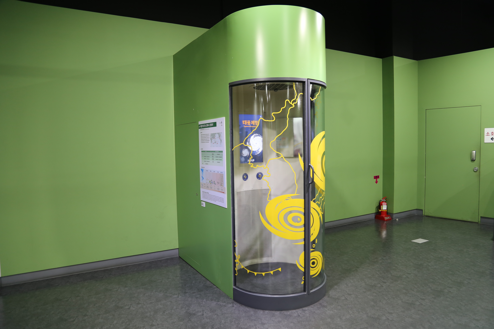

  <button class="nav-btn" onclick="goHome()">🏠 홈</button>
  <button class="nav-btn" onclick="goHall('green')">🟢 Green 전시실 개요</button>
  <button class="nav-btn" onclick="goBack()">⬅ 이전 페이지</button>

# G24 지진의 발생 원인 및 현황

## 1. 전시물 기본 내용
### 1.1 전시물 이미지

  
전시 목적

  

    판구조론으로 설명되는 지진대에 대해 알아보고 수렴경계, 발산경계, 보존경계에 대해 이해한다.
  

  
전시 유형 : 체험형

  

    터치 모니터를 이용해 자구상의 실제 수렴, 발산, 보존 경계를 그려보고, 그 내용을 알아보는 전시물
  

### 1.2 학교 교육과정  
<!--
curriculum-table은 전시물과 연결된 학교 교육과정을 학년별로 비교하는 표이다.
내용체계 칸에는 정적 웹에 포함된 내부 교육과정 문서 링크를 넣는다.
챕터 및 단원명 칸에는 외부 교과서/교과 챕터 링크를 넣는다.
전시물과 연계성 칸에는 전시물에서 어떤 개념과 연결되는지 적는다.
비고 칸에는 학년별 수준 변화, 해설 시 유의점, 확인이 필요한 내용을 적는다.
-->

<table class="curriculum-table">
  <caption><b>학교 교육과정</b></caption>
  <thead>
    <tr>
      <th rowspan="2">교육과정 내용체계</th>
      <th colspan="2">해당 교과과정(교과서)</th>
      <th rowspan="2">전시물과 연계성</th>
      <th rowspan="2">비고</th>
    </tr>
    <tr>
      <th>학년 및 학기</th>
      <th>챕터 및 단원명</th>
    </tr>
  </thead>
  <tfoot>
    <tr>
      <td colspan="5">
        <ul>
          <li>교과챕터 및 단원명은 출판사의 교과서 pdf링크로 연결됩니다.</li>
          <li>고등2~3학년 과정은 선택교과입니다.</li>
        </ul>
      </td>
    </tr>
  </tfoot>
  <tbody>
    <tr>
          <td>
            <a class="curriculum-link-button" href="#/docs/school_curriculum/science/common/00_common_science_elementry3-4">
              초등학교 3~4학년 &gt; 땅의 변화
            </a>
          </td>
          <td>초등4-1</td>
          <td><a class="curriculum-link-button external" href="https://s3.ap-northeast-2.amazonaws.com/tsol.jihak.co.kr/tsol/22tp/e/sci/JIHAKSA_%EA%B3%BC%ED%95%99_%EC%B4%88_4-1_%EA%B5%90%EA%B3%BC%EC%84%9C.pdf" target="_blank" rel="noopener">
              3. 땅의 변화 (22개정 지학사 과학 4-1 pp 72-91)</a></td>
          <td>다양한 지진사례와 지진발생의 원인 활동 과정에서 지권의 구성과 변화 및 지구 환경 요소의 상호작용을 이해함</td>
          <td>판 구조와 같은 화산과 지진활동의 원인은 분석하지 않으며, 그 현상과 피해, 그리고 대피방법과 같은 대응법을 학습</td>
        </tr>
    <tr>
          <td>
            <a class="curriculum-link-button" href="#/docs/school_curriculum/science/common/00_common_science_mid">
            중학교 1~3학년 &gt; 지권의 변화
            </a>
          </td>
          <td>중등2학년</td>
          <td><a class="curriculum-link-button external" href="https://ibook.vivasam.com/CBS_iBook/10777/contents/index.html?skin=basic01" target="_blank" rel="noopener">
              I-1-02 층으로 이루어진 지권 (22개정 비상교과서 중등2 pp 48-51)</a></td>
          <td>지각의 이동과정을 살펴보며, 지구 내부의 층상구조를 확인함.</td>
          <td></td>
        </tr>
    <tr>
          <td>
            <a class="curriculum-link-button" href="#/docs/school_curriculum/science/common/00_common_science_mid">
            중학교 1~3학년 &gt; 지권의 변화
            </a>
          </td>
          <td>중등2학년</td>
          <td><a class="curriculum-link-button external" href="https://ibook.vivasam.com/CBS_iBook/10777/contents/index.html?skin=basic01" target="_blank" rel="noopener">
              I-3 대륙이동과 판의 경계 (22개정 비상교과서 중등2 pp 75-87)</a></td>
          <td>대륙이동설과 판의 경계, 그리고 판의 경계와 화산대, 지진대의 연관성에 대해 알아봄</td>
          <td></td>
        </tr>
    <tr>
          <td>
            <a class="curriculum-link-button" href="#/docs/school_curriculum/science/common/00_common_science_mid">
            중학교 1~3학년 &gt; 재해⋅재난과 안전
            </a>
          </td>
          <td>중3</td>
          <td>(교과서 링크 없음)</td>
          <td>재해⋅재난 사례 중 지진의 자료를 조사하고, 그 발생 원인과 피해에 대해 과학적으로 분석하는 법을 학습</td>
          <td></td>
        </tr>
    <tr>
          <td>
            <a class="curriculum-link-button" href="#/docs/school_curriculum/science/01_integrated_science">
            통합과학1 &gt; 시스템과 상호작용
            </a>
          </td>
          <td>고등1학년</td>
          <td><a class="curriculum-link-button external" href="https://ibook.vivasam.com/CBS_iBook/4506/contents/index.html?skin=basic01" target="_blank" rel="noopener">
                  III-1-02 지권의 변화와 영향 (22개정 비상교과서 통합과학1 pp 102-107)</a></td>
          <td>판구조론과 판의 경계 종류에 따른 지진, 화산활동 학습</td>
          <td></td>
        </tr>
<tr>
  <td>
    <a class="curriculum-link-button" href="#/docs/school_curriculum/science/13_earth_system_science">
    지구시스템과학
    </a>
  </td>
  <td>고등2~3학년</td>
  <td><a class="curriculum-link-button external" href="https://ibook.vivasam.com/CBS_iBook/6669/contents/index.html?skin=basic01" target="_blank" rel="noopener">
      I-03 판 구조 운동과 플룸 구조 운동 (22개정 비상교과서 지구시스템과학 pp 22-30)</a></td>
  <td>판구조론의 발전과정에 대해 학습</td>
  <td></td>
</tr>
  </tbody>
</table>

### 1.3 체험
##### 체험1) 다양한 지진사례와 지진발생의 원인 알아보기
1. 디지털 패널을 활용하여 지진발생의 원인, 세계 주요 지진사례를 알아본다.
2. 다양한 지진 사례와 지진발생의 원인 알아보기

##### 체험2) 여러 가지 판의 경계 알아보기
1. 화면에 표시된 세계 주요 지진대를 따라 그려본다.
2. 주요 지진대를 만드는 판의 경계에 대해 알아본다.
3. 판의 움직임을 통해 과거에서부터 변해온 대륙의 이동 경로를 확인한다.
4. 여러가지 판의 경계 알아보기

### 1.4 패널내용
(패널 없는 전시물)

## 2. 기본 과학 이론
### 2.1 핵심 과학이론

<!--
data-theories에는 연결할 이론 문서의 제목을 입력한다.
쉼표(,)로 여러 이론을 구분할 수 있으며, assets/js/theory-links.js에 등록된 제목과 일치하면 버튼형 링크로 표시된다.
등록되지 않은 제목은 비활성 표시로 나타난다.

-->

### 2.2 연관 과학이론

## 3. 연관 전시물

<!--
related-exhibit-link-list는 연관 전시물 문서로 이동하는 버튼 목록이다.
a 태그의 href에는 연결할 전시물 문서 경로를 입력한다.
버튼을 여러 개 넣으면 세로로 정렬된다.

  <a class="related-exhibit-link-button" href="#/docs/halls/blue/B01">B01 세상은 어떻게 연결되어 있을까?</a>

-->

## 4. 기존 해설에서의 쓰임 예시

## 5. 확장 자료

### 심화 이론

<!--
resource-link-list는 확장 자료 링크를 세로로 정렬하는 목록이다.
내부 문서는 href에 #/docs/... 형식의 정적 웹 문서 경로를 입력한다.
버튼을 여러 개 넣으면 세로로 정렬된다.

  <a class="resource-link-button" href="#/docs/theory/zzz_incomplete">이론 양식 문서 보기</a>

-->

### 최신 연구

<!--
resource-link-list는 확장 자료 링크를 세로로 정렬하는 목록이다.
외부 자료는 href에 전체 URL을 입력하고 target="_blank" rel="noopener"를 함께 사용한다.
버튼을 여러 개 넣으면 세로로 정렬된다.

  <a class="resource-link-button external" href="https://www.google.com" target="_blank" rel="noopener">외부 연구 자료 보기</a>

-->

<!--
doc-tags는 문서에 해시태그를 표시하는 영역이다.
data-tags에 쉼표로 구분한 태그 이름을 입력한다.
태그 이름에는 #을 직접 붙이지 않는다.

-->

## 변경기록
| 변경일        | 작성자 | 내용 및 사유 |
| ---------- | --- | ------- |
| 2026.01.22 | 박은선 | 최초 작성   |
|            |     |         |

  <button class="nav-btn" onclick="goHome()">🏠 홈</button>
  <button class="nav-btn" onclick="goHall('green')">🟢 Green 전시실 개요</button>
  <button class="nav-btn" onclick="goBack()">⬅ 이전 페이지</button>

