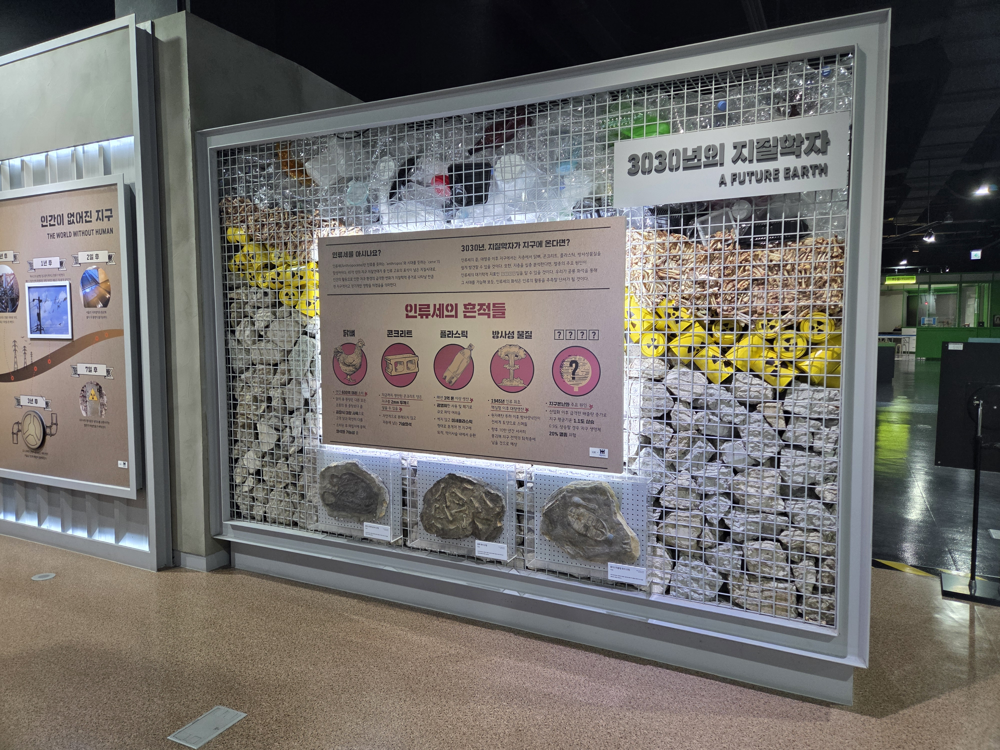

  <button class="nav-btn" onclick="goHome()">🏠 홈</button>
  <button class="nav-btn" onclick="goHall('green')">🟢 Green 전시실 개요</button>
  <button class="nav-btn" onclick="goBack()">⬅ 이전 페이지</button>

# G30 3030년의 지질학자

## 1. 전시물 기본 내용
### 1.1 전시물 이미지

  
전시 목적

  

    미래에 만나볼 수 있을 화석(플라스틱, 닭뼈, 콘크리트, 방사성 물질)을 모형으로 나타낸 전시물을 살펴보고, 3030년에 살고 있는 지질학의 관점에서 화석을 관찰하고 인류세에 대해 알아본다.
  

  
전시 유형 : 관람형

  

    아날로그 패널 및 화석연출물을 관람하는 전시물
  

### 1.2 학교 교육과정  
<!--
curriculum-table은 전시물과 연결된 학교 교육과정을 학년별로 비교하는 표이다.
내용체계 칸에는 정적 웹에 포함된 내부 교육과정 문서 링크를 넣는다.
챕터 및 단원명 칸에는 외부 교과서/교과 챕터 링크를 넣는다.
전시물과 연계성 칸에는 전시물에서 어떤 개념과 연결되는지 적는다.
비고 칸에는 학년별 수준 변화, 해설 시 유의점, 확인이 필요한 내용을 적는다.
-->

<table class="curriculum-table">
  <caption><b>학교 교육과정</b></caption>
  <thead>
    <tr>
      <th rowspan="2">교육과정 내용체계</th>
      <th colspan="2">해당 교과과정(교과서)</th>
      <th rowspan="2">전시물과 연계성</th>
      <th rowspan="2">비고</th>
    </tr>
    <tr>
      <th>학년 및 학기</th>
      <th>챕터 및 단원명</th>
    </tr>
  </thead>
  <tfoot>
    <tr>
      <td colspan="5">
        <ul>
          <li>교과챕터 및 단원명은 출판사의 교과서 pdf링크로 연결됩니다.</li>
          <li>고등2~3학년 과정은 선택교과입니다.</li>
        </ul>
      </td>
    </tr>
  </tfoot>
  <tbody>
    <tr>
          <td>
            <a class="curriculum-link-button" href="#/docs/school_curriculum/science/common/00_common_science_elementry5-6">
              초등학교 5~6학년 &gt; 지층과 화석
            </a>
          </td>
          <td>초등5-1</td>
          <td><a class="curriculum-link-button external" href="https://wbook.jihak.co.kr/SynapDocViewServer/viewer/doc.html?key=9fddc34069f6464c88e119b0154ab910&convType=img&convLocale=ko_KR&contextPath=/SynapDocViewServer" target="_blank" rel="noopener">
              1. 지층과 화석 (22개정 지학사 과학 5-1 pp 18-33)</a></td>
          <td>인류세와 그 흔적 활동 과정에서 지권의 구성과 변화 및 지구 환경 요소의 상호작용을 이해함</td>
          <td></td>
        </tr>
    <tr>
          <td>
            <a class="curriculum-link-button" href="#/docs/school_curriculum/science/01_integrated_science">
            통합과학2 &gt; 변화와 다양성
            </a>
          </td>
          <td>고등1학년</td>
          <td><a class="curriculum-link-button external" href="https://ibook.vivasam.com/CBS_iBook/3784/contents/index.html?skin=basic01" target="_blank" rel="noopener">
                  I-1-01 지구 환경 변화 (22개정 비상교과서 통합과학2 pp 16-21)</a></td>
          <td>지질시대에 따른 생물상의 변화 및 대멸종에 대해 학습함</td>
          <td></td>
        </tr>
    <tr>
          <td>
            <a class="curriculum-link-button" href="#/docs/school_curriculum/science/01_integrated_science">
            통합과학2 &gt; 환경과 에너지
            </a>
          </td>
          <td>고등1학년</td>
          <td><a class="curriculum-link-button external" href="https://ibook.vivasam.com/CBS_iBook/3784/contents/index.html?skin=basic01" target="_blank" rel="noopener">
                  II-1 생태계와 환경변화 (22개정 비상교과서 통합과학2 pp 62-83)</a></td>
          <td>생태계의 구성요소들과 그 구성요소의 일환인 환경의 변화가 자연과 인간생활에 어떤 영향을 주는지 학습</td>
          <td></td>
        </tr>
<tr>
  <td>
    <a class="curriculum-link-button" href="#/docs/school_curriculum/science/15_history_and_culture_of_science">
    과학의 역사와 문화
    </a>
  </td>
  <td>고등2~3학년</td>
  <td><a class="curriculum-link-button external" href="https://ibook.vivasam.com/CBS_iBook/6657/contents/index.html?skin=basic01" target="_blank" rel="noopener">
      II-02 과학자의 논쟁과 과학 연구의 규범 (22개정 비상교과서 과학의 역사와 문화 pp 86-97)</a></td>
  <td>인류세에 대한 과학적 논쟁에 대한 내용이 있음</td>
  <td></td>
</tr>
  </tbody>
</table>

### 1.3 체험
##### 체험1) 인류세와 그 흔적 알아보기
1. 층을 이루어 벽면을 채우고 있는 퇴적물과 화석 모형을 관찰한다.
2. 패널을 통해 인류세의 뜻을 알아본다.
3. 패널을 통해 어떤 것이, 무슨 이유로 인류세의 흔적으로 남을지 알아본다.

### 1.4 패널내용

  

    인류세의 흔적들
  

  

    
  

  

    화석 표찰
  

  

    
  

## 2. 기본 과학 이론
### 2.1 핵심 과학이론

<!--
data-theories에는 연결할 이론 문서의 제목을 입력한다.
쉼표(,)로 여러 이론을 구분할 수 있으며, assets/js/theory-links.js에 등록된 제목과 일치하면 버튼형 링크로 표시된다.
등록되지 않은 제목은 비활성 표시로 나타난다.
-->

### 2.2 연관 과학이론

## 3. 연관 전시물

<!--
related-exhibit-link-list는 연관 전시물 문서로 이동하는 버튼 목록이다.
a 태그의 href에는 연결할 전시물 문서 경로를 입력한다.
버튼을 여러 개 넣으면 세로로 정렬된다.
-->

  <a class="related-exhibit-link-button" href="#/docs/halls/blue/B01">B01 세상은 어떻게 연결되어 있을까?</a>

## 4. 기존 해설에서의 쓰임 예시

## 5. 확장 자료

### 심화 이론

<!--
resource-link-list는 확장 자료 링크를 세로로 정렬하는 목록이다.
내부 문서는 href에 #/docs/... 형식의 정적 웹 문서 경로를 입력한다.
버튼을 여러 개 넣으면 세로로 정렬된다.

  <a class="resource-link-button" href="#/docs/theory/zzz_incomplete">이론 양식 문서 보기</a>

-->

### 최신 연구

<!--
resource-link-list는 확장 자료 링크를 세로로 정렬하는 목록이다.
외부 자료는 href에 전체 URL을 입력하고 target="_blank" rel="noopener"를 함께 사용한다.
버튼을 여러 개 넣으면 세로로 정렬된다.

  <a class="resource-link-button external" href="https://www.google.com" target="_blank" rel="noopener">외부 연구 자료 보기</a>

-->

<!--
doc-tags는 문서에 해시태그를 표시하는 영역이다.
data-tags에 쉼표로 구분한 태그 이름을 입력한다.
태그 이름에는 #을 직접 붙이지 않는다.

-->

## 변경기록
| 변경일        | 작성자 | 내용 및 사유 |
| ---------- | --- | ------- |
| 2026.01.22 | 박은선 | 최초 작성   |
|            |     |         |

  <button class="nav-btn" onclick="goHome()">🏠 홈</button>
  <button class="nav-btn" onclick="goHall('green')">🟢 Green 전시실 개요</button>
  <button class="nav-btn" onclick="goBack()">⬅ 이전 페이지</button>

