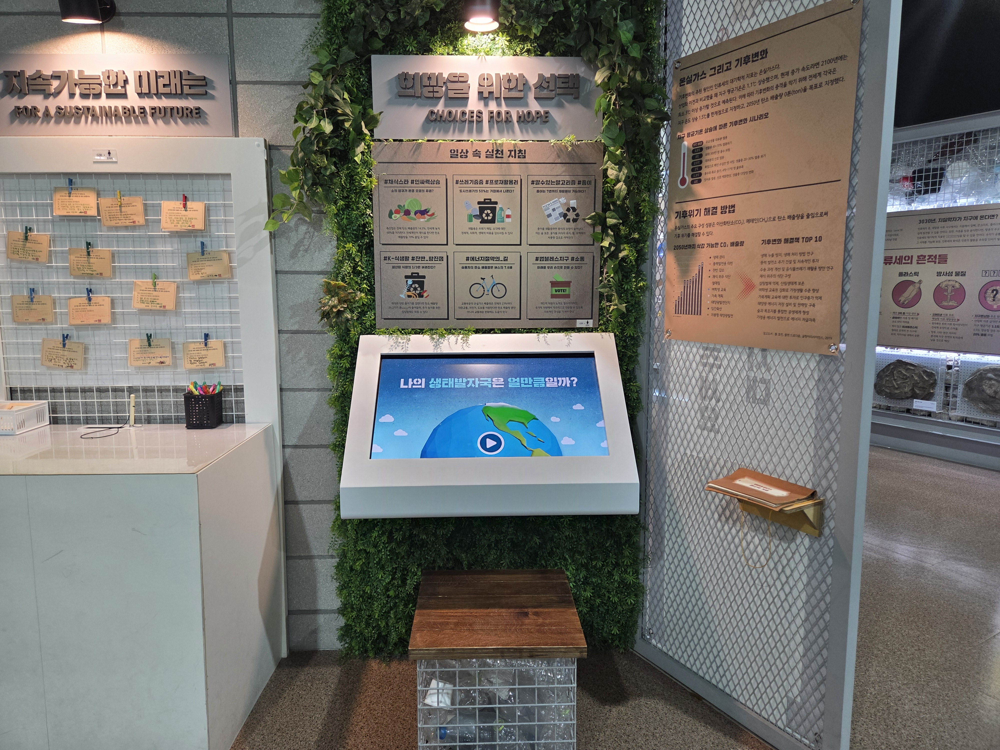

  <button class="nav-btn" onclick="goHome()">🏠 홈</button>
  <button class="nav-btn" onclick="goHall('green')">🟢 Green 전시실 개요</button>
  <button class="nav-btn" onclick="goBack()">⬅ 이전 페이지</button>

# G39 희망을 위한 선택

## 1. 전시물 기본 내용
### 1.1 전시물 이미지

  
전시 목적

  

    일상 속의 선택의 순간을 되짚어보며 그 선택이 지구에 어떤 영향을 미치는지 알아보고, 반성하는 시간을 가져본다.
  

  
전시 유형 : 체험형

  

    터치 모니터가 있는 체험형 전시물
  

### 1.2 학교 교육과정  
<!--
curriculum-table은 전시물과 연결된 학교 교육과정을 학년별로 비교하는 표이다.
내용체계 칸에는 정적 웹에 포함된 내부 교육과정 문서 링크를 넣는다.
챕터 및 단원명 칸에는 외부 교과서/교과 챕터 링크를 넣는다.
전시물과 연계성 칸에는 전시물에서 어떤 개념과 연결되는지 적는다.
비고 칸에는 학년별 수준 변화, 해설 시 유의점, 확인이 필요한 내용을 적는다.
-->

<table class="curriculum-table">
  <caption><b>학교 교육과정</b></caption>
  <thead>
    <tr>
      <td>
        <a class="curriculum-link-button" href="#/docs/school_curriculum/science/01_integrated_science">
        통합과학2 &gt; 환경과 에너지
        </a>
      </td>
      <td></td>
      <td></td>
      <td>나의 생태발자국 확인 활동 과정에서 인간 활동과 환경 변화의 관계를 살펴보고 지속가능한 해결 방법을 생각함</td>
      <td></td>
    </tr>
    <tr>
      <td>
        <a class="curriculum-link-button" href="#/docs/school_curriculum/science/02_science_inquiry_experiment">
        과학탐구실험1 &gt; 과학 탐구의 과정과 절차
        </a>
      </td>
      <td></td>
      <td></td>
      <td>나의 생태발자국 확인 활동 과정에서 관찰·측정·분류와 증거를 활용하는 과학 탐구 과정을 이해함</td>
      <td></td>
    </tr>
    <tr>
      <td>
        <a class="curriculum-link-button" href="#/docs/school_curriculum/science/09_matter_and_energy">
        물질과 에너지 &gt; 화학 변화의 자발성
        </a>
      </td>
      <td></td>
      <td></td>
      <td>나의 생태발자국 확인 활동 과정에서 물질의 성질과 구조, 변화 과정에서 나타나는 현상을 관찰하고 이해함</td>
      <td></td>
    </tr>
    <tr>
      <td>
        <a class="curriculum-link-button" href="#/docs/school_curriculum/science/16_climate_change_and_environmental_ecology">
        기후변화와 환경생태 &gt; 기후위기와 환경생태 변화
        </a>
      </td>
      <td></td>
      <td></td>
      <td>나의 생태발자국 확인 활동 과정에서 인간 활동과 환경 변화의 관계를 살펴보고 지속가능한 해결 방법을 생각함</td>
      <td></td>
    </tr>
    <tr>
      <td>
        <a class="curriculum-link-button" href="#/docs/school_curriculum/science/16_climate_change_and_environmental_ecology">
        기후변화와 환경생태 &gt; 기후위기에 대응하는 우리의 노력
        </a>
      </td>
      <td></td>
      <td></td>
      <td>나의 생태발자국 확인 활동 과정에서 인간 활동과 환경 변화의 관계를 살펴보고 지속가능한 해결 방법을 생각함</td>
      <td></td>
    </tr>
    <tr>
      <td>
        <a class="curriculum-link-button" href="#/docs/school_curriculum/science/17_convergence_science_inquiry">
        융합과학 탐구 &gt; 융합과학 탐구의 전망
        </a>
      </td>
      <td></td>
      <td></td>
      <td>나의 생태발자국 확인 활동 과정에서 관찰·측정·분류와 증거를 활용하는 과학 탐구 과정을 이해함</td>
      <td></td>
    </tr>
  </tbody>
</table>

### 1.3 체험
##### 체험1) 나의 생태발자국 확인해보기
1. 학교 가는 날, 여행 가는 날, 오늘은 쉬는 날 중 하나를 골라 자신의 평소 생활처럼 선택을 한다.
2. 결과 리포트를 확인한다.
3. 평소 생활보다 더 좋은 선택지에 대해 고민해본다.

### 1.4 패널내용

  

    일상 속 실천 지침
  

  

    
  

## 2. 기본 과학 이론
### 2.1 핵심 과학이론

<!--
data-theories에는 연결할 이론 문서의 제목을 입력한다.
쉼표(,)로 여러 이론을 구분할 수 있으며, assets/js/theory-links.js에 등록된 제목과 일치하면 버튼형 링크로 표시된다.
등록되지 않은 제목은 비활성 표시로 나타난다.
-->

### 2.2 연관 과학이론

## 3. 연관 전시물

<!--
related-exhibit-link-list는 연관 전시물 문서로 이동하는 버튼 목록이다.
a 태그의 href에는 연결할 전시물 문서 경로를 입력한다.
버튼을 여러 개 넣으면 세로로 정렬된다.

  <a class="related-exhibit-link-button" href="#/docs/halls/blue/B01">B01 세상은 어떻게 연결되어 있을까?</a>

-->

## 4. 기존 해설에서의 쓰임 예시

## 5. 확장 자료

### 심화 이론

<!--
resource-link-list는 확장 자료 링크를 세로로 정렬하는 목록이다.
내부 문서는 href에 #/docs/... 형식의 정적 웹 문서 경로를 입력한다.
버튼을 여러 개 넣으면 세로로 정렬된다.

  <a class="resource-link-button" href="#/docs/theory/zzz_incomplete">이론 양식 문서 보기</a>

-->

### 최신 연구

<!--
resource-link-list는 확장 자료 링크를 세로로 정렬하는 목록이다.
외부 자료는 href에 전체 URL을 입력하고 target="_blank" rel="noopener"를 함께 사용한다.
버튼을 여러 개 넣으면 세로로 정렬된다.

  <a class="resource-link-button external" href="https://www.google.com" target="_blank" rel="noopener">외부 연구 자료 보기</a>

-->

<!--
doc-tags는 문서에 해시태그를 표시하는 영역이다.
data-tags에 쉼표로 구분한 태그 이름을 입력한다.
태그 이름에는 #을 직접 붙이지 않는다.

-->

## 변경기록
| 변경일        | 작성자 | 내용 및 사유 |
| ---------- | --- | ------- |
| 2026.01.22 | 박은선 | 최초 작성   |
|            |     |         |

  <button class="nav-btn" onclick="goHome()">🏠 홈</button>
  <button class="nav-btn" onclick="goHall('green')">🟢 Green 전시실 개요</button>
  <button class="nav-btn" onclick="goBack()">⬅ 이전 페이지</button>

