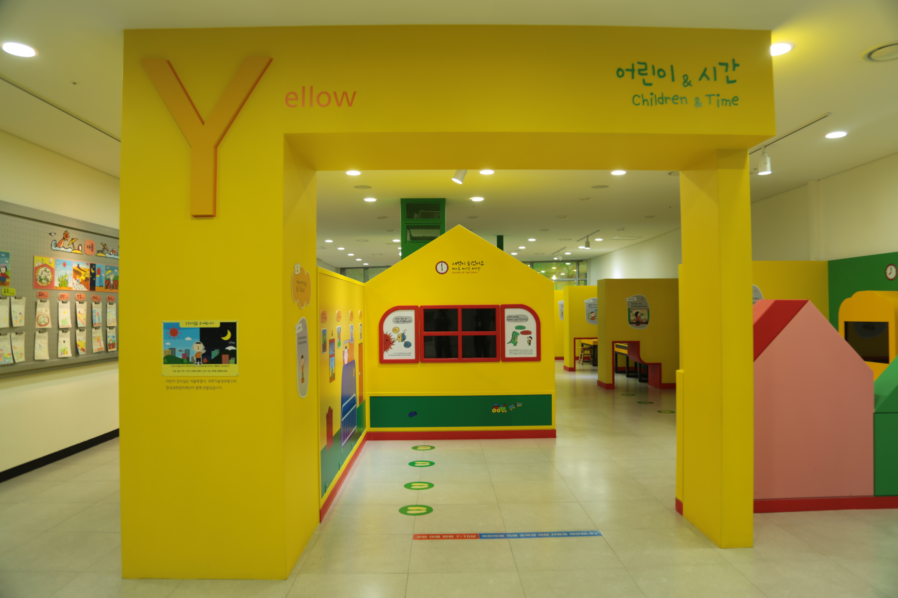

---
문서양식: 전시실 소개
전시실: Y전시실
---

# 🏠 [홈](/)으로 가기
##
# Y전시실(어린이와 시간)

## 1. 전시실 소개
시간의 흐름에 따라 어린이의 일상 속 과학원리를 찾아보고 체험하는 공간입니다. 아침, 점심, 저녁 그리고 사계절 속에서 느낄 수 있는 과학을 경험해 보세요.

## 2. 전시물
### 2.1 전시물 배치도
*(작성 중)*
<!--

  

  <a class="map-marker" style="left: 85.44%; top: 44.36%;" href="#/docs/halls/blue/B01" aria-label="B01 전시물">1</a>
  <a class="map-marker" style="left: 82.11%; top: 17.87%;" href="#/docs/halls/blue/B02" aria-label="B02 전시물">2</a>
  <a class="map-marker" style="left: 79.29%; top: 14.88%;" href="#/docs/halls/blue/B03" aria-label="B03 전시물">3</a>
  <a class="map-marker" style="left: 76.15%; top: 14.89%;" href="#/docs/halls/blue/B04" aria-label="B04 전시물">4</a>
  <a class="map-marker" style="left: 73.01%; top: 14.90%;" href="#/docs/halls/blue/B05" aria-label="B05 전시물">5</a>
  <a class="map-marker" style="left: 69.86%; top: 14.88%;" href="#/docs/halls/blue/B06" aria-label="B06 전시물">6</a>
  <a class="map-marker" style="left: 66.71%; top: 14.91%;" href="#/docs/halls/blue/B07" aria-label="B07 전시물">7</a>
  <a class="map-marker" style="left: 59.43%; top: 18.19%;" href="#/docs/halls/blue/B08" aria-label="B08 전시물">8</a>
  <a class="map-marker" style="left: 53.98%; top: 16.16%;" href="#/docs/halls/blue/B09" aria-label="B09 전시물">9</a>
  <a class="map-marker" style="left: 49.65%; top: 17.59%;" href="#/docs/halls/blue/B10" aria-label="B10 전시물">10</a>
  <a class="map-marker" style="left: 47.50%; top: 20.73%;" href="#/docs/halls/blue/B11" aria-label="B11 전시물">11</a>
  <a class="map-marker" style="left: 61.86%; top: 22.37%;" href="#/docs/halls/blue/B12" aria-label="B12 전시물">12</a>
  <a class="map-marker" style="left: 74.31%; top: 41.86%;" href="#/docs/halls/blue/B13" aria-label="B13 전시물">13</a>
  <a class="map-marker" style="left: 66.66%; top: 45.41%;" href="#/docs/halls/blue/B14" aria-label="B14 전시물">14</a>
  <a class="map-marker" style="left: 72.25%; top: 73.63%;" href="#/docs/halls/blue/B15" aria-label="B15 전시물">15</a>
  <a class="map-marker" style="left: 76.00%; top: 54.44%;" href="#/docs/halls/blue/B16" aria-label="B16 전시물">16</a>
  <a class="map-marker" style="left: 81.49%; top: 55.00%;" href="#/docs/halls/blue/B17" aria-label="B17 전시물">17</a>
  <a class="map-marker" style="left: 89.73%; top: 58.71%;" href="#/docs/halls/blue/B18" aria-label="B18 전시물">18</a>
  <a class="map-marker" style="left: 89.03%; top: 71.25%;" href="#/docs/halls/blue/B19" aria-label="B19 전시물">19</a>
  <a class="map-marker" style="left: 91.57%; top: 93.93%;" href="#/docs/halls/blue/B20" aria-label="B20 전시물">20</a>
  <a class="map-marker" style="left: 79.60%; top: 93.40%;" href="#/docs/halls/blue/B21" aria-label="B21 전시물">21</a>
  <a class="map-marker" style="left: 66.35%; top: 67.99%;" href="#/docs/halls/blue/B22" aria-label="B22 전시물">22</a>
  <a class="map-marker" style="left: 62.04%; top: 67.97%;" href="#/docs/halls/blue/B23" aria-label="B23 전시물">23</a>
  <a class="map-marker" style="left: 54.37%; top: 91.08%;" href="#/docs/halls/blue/B24" aria-label="B24 전시물">24</a>
  <a class="map-marker" style="left: 48.59%; top: 85.84%;" href="#/docs/halls/blue/B25" aria-label="B25 전시물">25</a>
  <a class="map-marker" style="left: 45.99%; top: 88.33%;" href="#/docs/halls/blue/B26" aria-label="B26 전시물">26</a>
  <a class="map-marker" style="left: 47.97%; top: 61.23%;" href="#/docs/halls/blue/B27" aria-label="B27 전시물">27</a>
  <a class="map-marker" style="left: 47.23%; top: 54.50%;" href="#/docs/halls/blue/B28" aria-label="B28 전시물">28</a>
  <a class="map-marker" style="left: 39.08%; top: 48.23%;" href="#/docs/halls/blue/B29" aria-label="B29 전시물">29</a>
  <a class="map-marker" style="left: 42.99%; top: 66.90%;" href="#/docs/halls/blue/B30" aria-label="B30 전시물">30</a>
  <a class="map-marker" style="left: 40.20%; top: 92.63%;" href="#/docs/halls/blue/B31" aria-label="B31 전시물">31</a>
  <a class="map-marker" style="left: 32.34%; top: 90.28%;" href="#/docs/halls/blue/B32" aria-label="B32 전시물">32</a>
  <a class="map-marker" style="left: 31.17%; top: 73.41%;" href="#/docs/halls/blue/B33" aria-label="B33 전시물">33</a>
  <a class="map-marker" style="left: 30.97%; top: 61.55%;" href="#/docs/halls/blue/B34" aria-label="B34 전시물">34</a>
  <a class="map-marker" style="left: 33.51%; top: 46.80%;" href="#/docs/halls/blue/B35" aria-label="B35 전시물">35</a>
  <a class="map-marker" style="left: 28.60%; top: 44.74%;" href="#/docs/halls/blue/B36" aria-label="B36 전시물">36</a>
  <a class="map-marker" style="left: 25.13%; top: 78.73%;" href="#/docs/halls/blue/B37" aria-label="B37 전시물">37</a>
  <a class="map-marker" style="left: 21.81%; top: 53.26%;" href="#/docs/halls/blue/B38" aria-label="B38 전시물">38</a>
  <a class="map-marker" style="left: 21.81%; top: 43.45%;" href="#/docs/halls/blue/B39" aria-label="B39 전시물">39</a>
  <a class="map-marker" style="left: 9.88%; top: 7.41%;" href="#/docs/halls/blue/B40" aria-label="B40 전시물">40</a>
  <a class="map-marker" style="left: 13.77%; top: 15.84%;" href="#/docs/halls/blue/B41" aria-label="B41 전시물">41</a>
  <a class="map-marker" style="left: 18.92%; top: 15.68%;" href="#/docs/halls/blue/B42" aria-label="B42 전시물">42</a>
  <a class="map-marker" style="left: 25.81%; top: 18.77%;" href="#/docs/halls/blue/B43" aria-label="B43 전시물">43</a>
  <a class="map-marker" style="left: 31.18%; top: 15.37%;" href="#/docs/halls/blue/B44" aria-label="B44 전시물">44</a>
  <a class="map-marker" style="left: 34.00%; top: 16.14%;" href="#/docs/halls/blue/B45" aria-label="B45 전시물">45</a>
  <a class="map-marker" style="left: 36.72%; top: 23.71%;" href="#/docs/halls/blue/B46" aria-label="B46 전시물">46</a>
  <a class="map-marker" style="left: 38.24%; top: 16.16%;" href="#/docs/halls/blue/B47" aria-label="B47 전시물">47</a>
  <a class="map-marker" style="left: 42.31%; top: 15.95%;" href="#/docs/halls/blue/B48" aria-label="B48 전시물">48</a>

### 2.2 전시물 리스트

  

    전시물 분류 기준
  

  

    <ul>관람형 : 전시 패널 및 영상물 등을 통해 정보를 제공하는 전시물</ul>
    <ul>체험형 : 버튼, 레버, 터치패널 및 아날로그 요소 등 인터렉션 요소가 있는 전시물</ul>
    <ul>실험탐구 : 전시물로 실험을 진행할 수 있으며, 이를 활용한 자발적 탐구를 권장하는 전시물</ul>
    <ul>게임형 : 게이밍적 체험요소가 있음</ul>
  

| 전시물 번호 | 전시물 명                                                                                         | 분류  | 비고  |
| ------ | --------------------------------------------------------------------------------------------- | --- | --- |
| B01    | [세상은 어떻게 연결되어 있을까?](/docs/halls/blue/B01.md)                                              | 관람형 |     |
| B02    | [과학의 알파벳, 기본단위는? (1)길이(m)](/docs/halls/blue/B02.md)                                      | 관람형 |     |
| B03    | [과학의 알파벳, 기본단위는? (2)시간(s)](/docs/halls/blue/B03.md)                                 | 체험형 |     |
| B04    | [과학의 알파벳, 기본단위는? (3)질량(kg)](/docs/halls/blue/B04.md)                               | 체험형 |     |
| B05    | [과학의 알파벳, 기본단위는? (4) 전류(A)](/docs/halls/blue/B05.md)                                | 체험형/실험탐구 |     |
| B06    | [과학의 알파벳, 기본단위는? (5)온도(K)](/docs/halls/blue/B06.md)                                 | 체험형 |     |
| B07    | [과학의 알파벳, 기본단위는? (6) 몰(mol)](/docs/halls/blue/B07.md)                             | 관람형 |     |
| B08    | [과학의 알파벳, 기본단위는? (7)광도(cd)](/docs/halls/blue/B08.md)                              | 체험형 |     |
| B09    | [기본단위를 곱하거나 나누면 어떻게 될까? (1)Pixel](/docs/halls/blue/B09.md)                  | 체험형 |     |
| B10    | [기본단위를 곱하거나 나누면 어떻게 될까? (2)SV](/docs/halls/blue/B10.md)                       | 관람형 |     |
| B11    | [전류의 세기가 변하는 이유는?](/docs/halls/blue/B11.md)                                                 | 체험형/실험탐구 |     |
| B12    | [세상을 관찰하는 또 다른 방법 '적외선'](/docs/halls/blue/B12.md)                                      | 체험형 |     | 
| B13    | [복잡한 교통시스템, 어떻게 연결되어 있을까? (1)지하철에 대한 모든 것](/docs/halls/blue/B13.md) | 관람형 |     |
| B14    | [복잡한 교통시스템, 어떻게 연결되어 있을까? (2)수학으로 빠른 길 찾기](/docs/halls/blue/B14.md)  | 체험형/게임형 |     |
| B15    | [복잡한 교통시스템, 어떻게 연결되어 있을까? (3)비행기의 이동경로](/docs/halls/blue/B15.md)        | 체험형 |     |
| B16    | [교통카드에는 어떻게 정보가 담기고 전달될까?](/docs/halls/blue/B16.md)                                 | 체험형 |     |
| B17    | [진자가 흔들릴 때 옆의 진자를 흔들리게 할 수 있을까?](/docs/halls/blue/B17.md)                     | 체험형/실험탐구 |     |
| B18    | [RUN OUT](/docs/halls/blue/B18.md)                     | 체험형/게임형 |     |     |
| B19    | [자동차의 속도는 어떻게 측정할까?](/docs/halls/blue/B19.md)                                             | 체험형 |     |
| B20    | [자전거는 왜 넘어지지 않을까?](/docs/halls/blue/B20.md)                                                 | 체험형 |     |
| B21    | [진자가 왜 뱀처럼 춤출까?](/docs/halls/blue/B21.md)                                                     | 관람형 |     |
| B22    | [지하철은 어떻게 움직일까?](/docs/halls/blue/B22.md)                                                     | 체험형 |     |
| B23    | [비행기는 어떻게 하늘을 날까?](/docs/halls/blue/B23.md)                                                 | 체험형 |     |
| B24    | [춤추는 데칼코마니](/docs/halls/blue/B24.md)                                                              | 체험형/실험탐구 |     |
| B25    | [자극에 대한 반응은 어떻게 일어날까?](/docs/halls/blue/B25.md)                                         | 체험형 |     |
| B26    | [빛으로 표정을 바꿀 수 있을까?](/docs/halls/blue/B26.md)                                               | 체험형 |     |
| B27    | [내 머리 속에서는 무슨 일이 일어나고 있을까?](/docs/halls/blue/B27.md)                               | 체험형 |     |
| B28    | [침팬지보다 빠를 수 있을까?](/docs/halls/blue/B28.md)                                                   | 체험형/게임형 |     |
| B29    | [뇌가 크면 더 똑똑할까?](/docs/halls/blue/B29.md)                                                       | 체험형 |     |
| B30    | [눈이 보는 것일까? 뇌가 보는 것일까?](/docs/halls/blue/B30.md)                                        | 체험형 |     |
| B31    | [멀미를 하는 이유는?](/docs/halls/blue/B31.md)                                                           | 체험형 |     |
| B32    | [내 의지와 관계없이 몸에서 일어나는 일들은?](/docs/halls/blue/B32.md)                                 | 관람형 |     |
| B33    | [조선시대에는 망원경 없이 어떻게 하늘을 관찰했을까?](/docs/halls/blue/B33.md)                         | 관람형(체험요소 추가됨) |     |
| B34    | [땅의 넓이를 어떻게 구하지?](/docs/halls/blue/B34.md)                                                   | 체험형 |     |
| B35    | [좌표평면에서 도형을 이동시키면?](/docs/halls/blue/B35.md)                                               | 체험형/게임형 |     |
| B36    | [액체자석은 왜 솟아날까?](/docs/halls/blue/B36.md)                                                       | 체험형/실험탐구 |     |
| B37    | [조선시대에는 하늘에서 일어나는 현상을 어떻게 관찰하였을까?](/docs/halls/blue/B37.md)                 | 관람형 |     |
| B38    | [에라토스테네스는 지구의 크기를 어떻게 쟀을까?](/docs/halls/blue/B38.md)                               | 체험형/실험탐구 |     |
| B39    | [타원에서 원반은 어떻게 움직일까?](/docs/halls/blue/B39.md)                                             | 체험형/실험탐구 |     |
| B40    | [쇠구슬은 어디로 떨어질까?](/docs/halls/blue/B40.md)                                                     | 체험형/실험탐구 |     |
| B41    | [빛을 쪼개고 합칠 수 있을까?](/docs/halls/blue/B41.md)                                                 | 체험형/실험탐구 |     |
| B42    | [우리가 보는 색을 믿을 수 있을까?](/docs/halls/blue/B42.md)                                           | 체험형/실험탐구 |     |
| B43    | [달에서도 바람이 불까?](/docs/halls/blue/B43.md)                                                         | 체험형 |     |
| B44    | [밤의 카페테라스](/docs/halls/blue/B44.md)                                                                | 체험형 |     |
| B45    | [라그랑자트 섬의 일요일 오후](/docs/halls/blue/B45.md)                                                  | 체험형 |     |
| B46    | [월하정인](/docs/halls/blue/B46.md)                                                                        | 체험형/게임형 |     |
| B47    | [열린 창가에서 편지를 읽는 여인](/docs/halls/blue/B47.md)                                              | 체험형 |     |
| B48    | [절규](/docs/halls/blue/B48.md)                                                                            | 체험형 |     |

## 3. 전시실내 공간

## 변경기록
| 변경일        | 작성자 | 내용 및 사유 |
| ---------- | --- | ------- |
| 2026.01.22 | 박은선 | 최초 작성   |
|            |     |         |

-->
