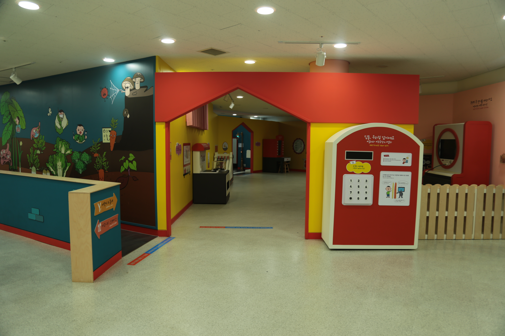

---
문서양식: 전시실 소개
전시실: YY전시실
---

# 🏠 [홈](/)으로 가기
##
# YY전시실(어린이와 공간)

## 1. 전시실 소개
어린이가 생활하는 공간에서 일상 속 과학원리를 찾아보고 체험하는 공간입니다. 방, 집, 길과 도로에 숨어있는 과학에는 어떤 것이 있는지 알아보세요.

## 2. 전시물
### 2.1 전시물 배치도

  

  <a class="map-marker" style="left: 5.82%; top: 84.12%;" href="#/docs/halls/kids/Yy01" aria-label="YY01 전시물 안내">1</a>
  <a class="map-marker" style="left: 5.82%; top: 74.18%;" href="#/docs/halls/kids/Yy02" aria-label="YY02 전시물 안내">2</a>
  <a class="map-marker" style="left: 14.34%; top: 82.19%;" href="#/docs/halls/kids/Yy03" aria-label="YY03 전시물 안내">3</a>
  <a class="map-marker" style="left: 18.82%; top: 77.63%;" href="#/docs/halls/kids/Yy04" aria-label="YY04 전시물 안내">4</a>
  <a class="map-marker" style="left: 21.28%; top: 61.72%;" href="#/docs/halls/kids/Yy05" aria-label="YY05 전시물 안내">5</a>
  <a class="map-marker" style="left: 40.05%; top: 61.81%;" href="#/docs/halls/kids/Yy06" aria-label="YY06 전시물 안내">6</a>
  <a class="map-marker" style="left: 42.43%; top: 87.44%;" href="#/docs/halls/kids/Yy08" aria-label="YY08 전시물 안내">8</a>
  <a class="map-marker" style="left: 52.69%; top: 81.09%;" href="#/docs/halls/kids/Yy09" aria-label="YY09 전시물 안내">9</a>
  <a class="map-marker" style="left: 56.91%; top: 74.63%;" href="#/docs/halls/kids/Yy10" aria-label="YY10 전시물 안내">10</a>
  <a class="map-marker" style="left: 60.23%; top: 62.72%;" href="#/docs/halls/kids/Yy11" aria-label="YY11 전시물 안내">11</a>
  <a class="map-marker" style="left: 70.88%; top: 53.26%;" href="#/docs/halls/kids/Yy12" aria-label="YY12 전시물 안내">12</a>
  <a class="map-marker" style="left: 63.71%; top: 45.26%;" href="#/docs/halls/kids/Yy13" aria-label="YY13 전시물 안내">13</a>
  <a class="map-marker" style="left: 57.94%; top: 38.87%;" href="#/docs/halls/kids/Yy14" aria-label="YY14 전시물 안내">14</a>
  <a class="map-marker" style="left: 52.28%; top: 37.38%;" href="#/docs/halls/kids/Yy15" aria-label="YY15 전시물 안내">15</a>
  <a class="map-marker" style="left: 50.72%; top: 46.75%;" href="#/docs/halls/kids/Yy16" aria-label="YY16 전시물 안내">16</a>
  <a class="map-marker" style="left: 28.29%; top: 46.77%;" href="#/docs/halls/kids/Yy17" aria-label="YY17 전시물 안내">17</a>
  <a class="map-marker" style="left: 27.12%; top: 30.40%;" href="#/docs/halls/kids/Yy18" aria-label="YY18 전시물 안내">18</a>

### 2.2 전시물 리스트

  

    전시물 분류 기준
  

  

    <ul>관람형 : 전시 패널 및 영상물 등을 통해 정보를 제공하는 전시물</ul>
    <ul>체험형 : 버튼, 레버, 터치패널 및 아날로그 요소 등 인터렉션 요소가 있는 전시물</ul>
    <ul>실험탐구 : 전시물로 실험을 진행할 수 있으며, 이를 활용한 자발적 탐구를 권장하는 전시물</ul>
    <ul>게임형 : 게이밍적 체험요소가 있음</ul>
  

| 전시물 번호 | 전시물 명 | 분류 | 비고 |
| ------ | ------- | --- | --- |
| YY01 | [함께 앉아 화음을 연주해요](/docs/halls/kids/Yy01.md) | 체험형/실험탐구 |  |
| YY02 | [딩동, 우리 집 앞이에요](/docs/halls/kids/Yy02.md) | 체험형/게임형 |  |
| YY03 | [콘센트 속 전기를 따라가요](/docs/halls/kids/Yy03.md) | 체험형 |  |
| YY04 | [탈수기가 빨래를 짜요](/docs/halls/kids/Yy04.md) | 체험형 |  |
| YY05 | [전기가 필요해요](/docs/halls/kids/Yy05.md) | 체험형/실험탐구 |  |
| YY06 | [집안에서 뛰어다녔어요](/docs/halls/kids/Yy06.md) | 체험형 |  |
| YY08 | [창문을 열면 시원해요](/docs/halls/kids/Yy08.md) | 체험형 |  |
| YY09 | [내 방 물건을 정리해요](/docs/halls/kids/Yy09.md) | 체험형 |  |
| YY10 | [옷 매무새를 다듬어요](/docs/halls/kids/Yy10.md) | 체험형 |  |
| YY11 | [어두운 길을 비춰줘요](/docs/halls/kids/Yy11.md) | 체험형 |  |
| YY12 | [다양한 길을 만들어 보아요](/docs/halls/kids/Yy12.md) | 체험형 |  |
| YY13 | [몇 층에서 나는 소리죠?](/docs/halls/kids/Yy13.md) | 체험형/게임형 |  |
| YY14 | [자전거 바퀴가 굴러가요](/docs/halls/kids/Yy14.md) | 관람형 |  |
| YY15 | [소중한 동물친구들을 소개해요](/docs/halls/kids/Yy15.md) | 체험형 |  |
| YY16 | [발밑 땅 속 세상이 궁금해요](/docs/halls/kids/Yy16.md) | 관람형 |  |
| YY17 | [사물이 달라 보여요](/docs/halls/kids/Yy17.md) | 관람형 |  |
| YY18 | [함께 도시를 만들어요](/docs/halls/kids/Yy18.md) | 체험형 |  |

## 3. 전시실내 공간

## 변경기록
| 변경일 | 작성자 | 내용 및 사유 |
| ------ | ------ | ------------ |
|        |        |              |

