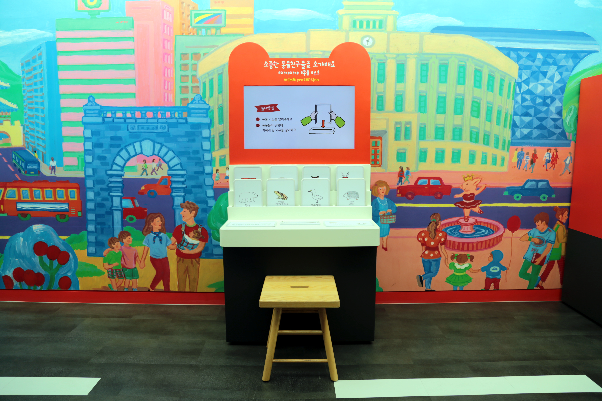

  <button class="nav-btn" onclick="goHome()">🏠 홈</button>
  <button class="nav-btn" onclick="goHall('yy')">🟡 YY 전시실 개요</button>
  <button class="nav-btn" onclick="goBack()">⬅ 이전 페이지</button>

# YY15 소중한 동물친구들을 소개해요

## 1. 전시물 기본 내용
### 1.1 전시물 이미지

  
전시 목적

  

    여러 종류의 멸종위기 동물이 그려져 있는 카드를 꽂아 소리를 들어봄으로써 그들이 처해있는 상황과 환경오염 문제에 대해 이해한다. 인간과 동물이 함께 살아가기 위해서 필요한 우리의 노력에는 무엇이 있는지 생각해본다.
  

  
전시 유형 : 체험형

  

    동물카드와 영상 모니터로 이루어져있는 전시물
  

### 1.2 학교 교육과정  
<!--
curriculum-table은 전시물과 연결된 학교 교육과정을 학년별로 비교하는 표이다.
내용체계 칸에는 정적 웹에 포함된 내부 교육과정 문서 링크를 넣는다.
챕터 및 단원명 칸에는 외부 교과서/교과 챕터 링크를 넣는다.
전시물과 연계성 칸에는 전시물에서 어떤 개념과 연결되는지 적는다.
비고 칸에는 학년별 수준 변화, 해설 시 유의점, 확인이 필요한 내용을 적는다.
-->

<table class="curriculum-table">
  <caption><b>학교 교육과정</b></caption>
  <thead>
    <tr>
      <th rowspan="2">교육과정 내용체계</th>
      <th colspan="2">해당 교과과정(교과서)</th>
      <th rowspan="2">전시물과 연계성</th>
      <th rowspan="2">비고</th>
    </tr>
    <tr>
      <th>학년 및 학기</th>
      <th>챕터 및 단원명</th>
    </tr>
  </thead>
  <tfoot>
    <tr>
      <td colspan="5">
        <ul>
          <li>교과챕터 및 단원명은 출판사의 교과서 pdf링크로 연결됩니다.</li>
          <li>고등2~3학년 과정은 선택교과입니다.</li>
        </ul>
      </td>
    </tr>
  </tfoot>
  <tbody>
    <tr>
          <td>
            <a class="curriculum-link-button" href="#/docs/school_curriculum/science/common/00_common_science_elementry3-4">
            초등학교 3~4학년 &gt; 동물의 생활
            </a>
          </td>
          <td>초등3-1</td>
          <td><a class="curriculum-link-button external" href="https://s3.ap-northeast-2.amazonaws.com/tsol.jihak.co.kr/tsol/22tp/e/sci/JIHAKSA_%EA%B3%BC%ED%95%99_%EC%B4%88_3-1_%EA%B5%90%EA%B3%BC%EC%84%9C.pdf" target="_blank" rel="noopener">
              2. 동물의 생활 (22개정 지학사 과학 3-1 pp 43~65)</a></td>
          <td>동물들의 이야기 들어보기 활동 과정에서 생명체의 구조와 기능 및 생명 현상이 유지되는 원리를 이해함</td>
          <td></td>
        </tr>
    <tr>
          <td>
            <a class="curriculum-link-button" href="#/docs/school_curriculum/science/common/00_common_science_elementry3-4">
            초등학교 3~4학년 &gt; 생물과 환경
            </a>
          </td>
          <td>초등4-2</td>
          <td><a class="curriculum-link-button external" href="https://s3.ap-northeast-2.amazonaws.com/tsol.jihak.co.kr/tsol/22tp/e/sci/JIHAKSA_%EA%B3%BC%ED%95%99_%EC%B4%88_4-1_%EA%B5%90%EA%B3%BC%EC%84%9C.pdf" target="_blank" rel="noopener">
              2. 생물과 환경 (22개정 지학사 과학 4-2 pp 38-57)</a></td>
          <td>동물들의 이야기 들어보기 활동 과정에서 인간 활동과 환경 변화의 관계를 살펴보고 지속가능한 해결 방법을 생각함</td>
          <td></td>
        </tr>
    <tr>
          <td>
            <a class="curriculum-link-button" href="#/docs/school_curriculum/science/common/00_common_science_elementry3-4">
            초등학교 3~4학년 &gt; 기후변화와 우리 생활
            </a>
          </td>
          <td>초등4-2</td>
          <td><a class="curriculum-link-button external" href="https://s3.ap-northeast-2.amazonaws.com/tsol.jihak.co.kr/tsol/22tp/e/sci/JIHAKSA_%EA%B3%BC%ED%95%99_%EC%B4%88_4-2_%EA%B5%90%EA%B3%BC%EC%84%9C.pdf" target="_blank" rel="noopener">
              4. 기후변화와 우리 생활 (22개정 지학사 과학 4-2 pp 86-101)</a></td>
          <td>동물들의 이야기 들어보기 활동 과정에서 대기와 해양에서 나타나는 현상 및 날씨와 기후의 변화를 이해함</td>
          <td></td>
        </tr>
    <tr>
          <td>
            <a class="curriculum-link-button" href="#/docs/school_curriculum/science/01_integrated_science">
            통합과학2 &gt; 환경과 에너지
            </a>
          </td>
          <td>고등1학년</td>
          <td><a class="curriculum-link-button external" href="https://ibook.vivasam.com/CBS_iBook/3784/contents/index.html?skin=basic01" target="_blank" rel="noopener">
                  II-1 생태계와 환경변화 (22개정 비상교과서 통합과학2 pp 62-83)</a></td>
          <td>생태계의 구성요소들과 그 구성요소의 일환인 환경의 변화가 자연과 인간생활에 어떤 영향을 주는지 학습</td>
          <td></td>
        </tr>
    <tr>
          <td>
            <a class="curriculum-link-button" href="#/docs/school_curriculum/science/16_climate_change_and_environmental_ecology">
            기후변화와 환경생태 &gt; 기후위기와 환경생태 변화
            </a>
          </td>
          <td></td>
          <td></td>
          <td>동물들의 이야기 들어보기 활동 과정에서 인간 활동과 환경 변화의 관계를 살펴보고 지속가능한 해결 방법을 생각함</td>
          <td></td>
        </tr>
    <tr>
          <td>
            <a class="curriculum-link-button" href="#/docs/school_curriculum/science/16_climate_change_and_environmental_ecology">
            기후변화와 환경생태 &gt; 기후위기에 대응하는 우리의 노력
            </a>
          </td>
          <td></td>
          <td></td>
          <td>동물들의 이야기 들어보기 활동 과정에서 인간 활동과 환경 변화의 관계를 살펴보고 지속가능한 해결 방법을 생각함</td>
          <td></td>
        </tr>
  </tbody>
</table>

### 1.3 체험
##### 체험1) 동물들의 이야기 들어보기
1. 동물카드를 슬롯에 넣어준다.
2. 나오는 영상을 통해 환경파괴로 인한 동물들의 위기에 대해 알아본다.

### 1.4 패널내용

  

    동물은 내 친구이자 가족같은 존재에요
  

  

    
  

  

    체험방법 안내
  

  

    
  

## 2. 기본 과학 이론
### 2.1 핵심 과학이론

<!--
data-theories에는 연결할 이론 문서의 제목을 입력한다.
쉼표(,)로 여러 이론을 구분할 수 있으며, assets/js/theory-links.js에 등록된 제목과 일치하면 버튼형 링크로 표시된다.
등록되지 않은 제목은 비활성 표시로 나타난다.

-->

### 2.2 연관 과학이론

## 3. 연관 전시물

<!--
related-exhibit-link-list는 연관 전시물 문서로 이동하는 버튼 목록이다.
a 태그의 href에는 연결할 전시물 문서 경로를 입력한다.
버튼을 여러 개 넣으면 세로로 정렬된다.

  <a class="related-exhibit-link-button" href="#/docs/halls/blue/B01">B01 세상은 어떻게 연결되어 있을까?</a>

-->

## 4. 기존 해설에서의 쓰임 예시

## 5. 확장 자료

### 심화 이론

<!--
resource-link-list는 확장 자료 링크를 세로로 정렬하는 목록이다.
내부 문서는 href에 #/docs/... 형식의 정적 웹 문서 경로를 입력한다.
버튼을 여러 개 넣으면 세로로 정렬된다.

  <a class="resource-link-button" href="#/docs/theory/zzz_incomplete">이론 양식 문서 보기</a>

-->

### 최신 연구

<!--
resource-link-list는 확장 자료 링크를 세로로 정렬하는 목록이다.
외부 자료는 href에 전체 URL을 입력하고 target="_blank" rel="noopener"를 함께 사용한다.
버튼을 여러 개 넣으면 세로로 정렬된다.

  <a class="resource-link-button external" href="https://www.google.com" target="_blank" rel="noopener">외부 연구 자료 보기</a>

-->

<!--
doc-tags는 문서에 해시태그를 표시하는 영역이다.
data-tags에 쉼표로 구분한 태그 이름을 입력한다.
태그 이름에는 #을 직접 붙이지 않는다.

-->

## 변경기록
| 변경일        | 작성자 | 내용 및 사유 |
| ---------- | --- | ------- |
| 2026.01.22 | 박은선 | 최초 작성   |
|            |     |         |

  <button class="nav-btn" onclick="goHome()">🏠 홈</button>
  <button class="nav-btn" onclick="goHall('yy')">🟡 YY 전시실 개요</button>
  <button class="nav-btn" onclick="goBack()">⬅ 이전 페이지</button>

