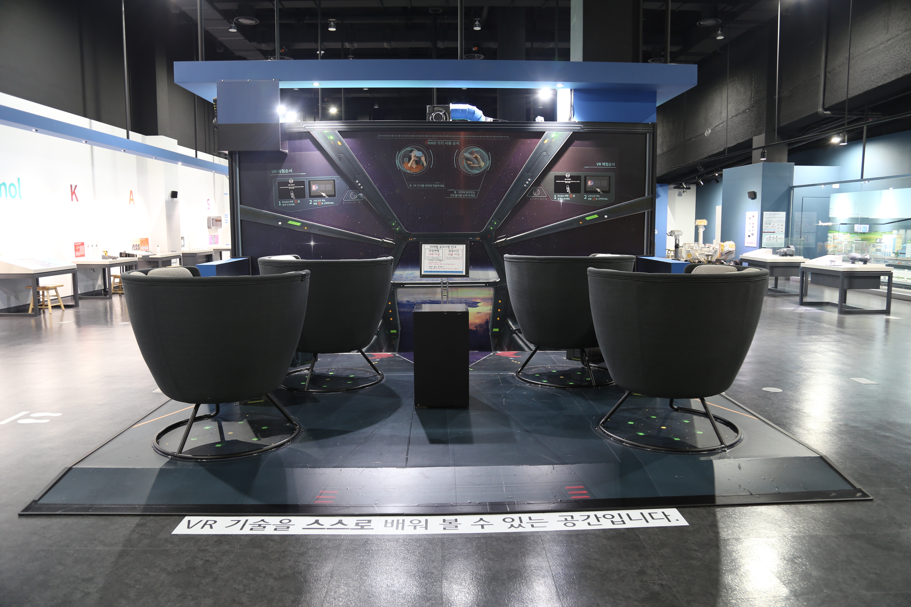

---
문서양식: 전시물
전시물 타입: 관람형, 패널
전시실: B전시실
---
#명화_속_과학 #공진효과 #파장

  <button class="nav-btn" onclick="goHome()">🏠 홈</button>
  <button class="nav-btn" onclick="goHall('blue')">🔵 Blue 전시실 개요</button>
  <button class="nav-btn" onclick="goBack()">⬅ 이전 페이지</button>

# 사물이 달라 보여요

## 1. 전시물 기본 내용
### 1.1 전시물 이미지

  
전시 목적

  

    과학기술로 인해 화가보다 더 실제와 똑같은 모습을 저장하는 카메라가 생겨난 이후 예술계의 화풍에 큰 변화가 일어났다. 사실적인 그림을 그리기보다 순간순간의 인상을 그려낸 신인상주의 화가, 그리고 화가 자신의 감정을 표현한 표현주의 화가의 그림들이 들어있는 카메라 속에서 그림과 관련된 과학 원리를 탐색해본다.
    <ul><li>절규 - 게임 요소를 통해 특정 진동수에서 큰 진폭으로 진동하게 되는 현상인 공진현상을 알아보고, 공진현상을 막기 위해 건축에 활용되는 원리를 생각해본다.<li></ul>
    </ul>
  

  
전시 유형 : 관람형

  

    자신의 키를 재볼 수 있는 간단한 체험이 있으나, 기본적으로 패널위주로 전시되어 있음
  

### 1.2 학교 교육과정  
<!--
curriculum-table은 전시물과 연결된 학교 교육과정을 학년별로 비교하는 표이다.
내용체계 칸에는 정적 웹에 포함된 내부 교육과정 문서 링크를 넣는다.
챕터 및 단원명 칸에는 외부 교과서/교과 챕터 링크를 넣는다.
전시물과 연계성 칸에는 전시물에서 어떤 개념과 연결되는지 적는다.
비고 칸에는 학년별 수준 변화, 해설 시 유의점, 확인이 필요한 내용을 적는다.
-->

<table class="curriculum-table">
  <caption><b>학교 교육과정</b></caption>
  <thead>
    <tr>
      <th colspan="2">교육과정 내용체계</th>
      <th colspan="2">해당 교과과정(교과서)</th>
      <th rowspan="2">전시물과 연계성</th>
      <th rowspan="2">비고</th>
    </tr>
    <tr>
      <th>학년(학군)</th>
      <th>내용체계</th>
      <th>학년 및 학기</th>
      <th>챕터 및 단원명</th>
    </tr>
  </thead>
  <tfoot>
    <tr>
      <td colspan="6">교과 챕터는 외부 사이트 링크를 통해 해당 단원을 확인한다.</td>
    </tr>
  </tfoot>
  <tbody>
    <tr>
      <th>초등1~2학년(수학)</th>
      <td>
        <a class="curriculum-link-button" href="#/docs/school_ curriculum/math/common/math_common_curriculum_knowledge_categories/common_curriculum_geometry_and_measurement">
          공통교육과정 &gt; 도형과 측정
        </a>
      </td>
      <td>1~2학년군</td>
      <td>
        <a class="curriculum-link-button external" href="https://example.com" target="_blank" rel="noopener">
          교과 챕터 링크
        </a>
      </td>
      <td>길이를 직접 재기보다 길이를 가늠하고 비교하는 경험과 연결된다.</td>
      <td>표준 단위보다 감각적 비교와 어림 중심으로 설명한다.</td>
    </tr>
    <tr>
      <th>초등3~4학년(수학)</th>
      <td>
        <a class="curriculum-link-button" href="#/docs/school_ curriculum/math/common/math_common_curriculum_knowledge_categories/common_curriculum_geometry_and_measurement">
          공통교육과정 &gt; 도형과 측정
        </a>
      </td>
      <td>3학년 1학기</td>
      <td>
        <a class="curriculum-link-button external" href="https://example.com" target="_blank" rel="noopener">
          5. 길이와 시간
        </a>
      </td>
      <td>m, cm 등 표준 단위를 사용해 길이를 정확히 측정하는 내용과 연결된다.</td>
      <td>1~2학년보다 단위와 측정 도구를 명확히 다룰 수 있다.</td>
    </tr>
    <tr>
      <th>초등5~6학년</th>
      <td></td>
      <td></td>
      <td></td>
      <td></td>
      <td></td>
    </tr>
    <tr>
      <th>중학교</th>
      <td></td>
      <td></td>
      <td></td>
      <td></td>
      <td></td>
    </tr>
    <tr>
      <th>고등학교(공통)</th>
      <td></td>
      <td></td>
      <td></td>
      <td></td>
      <td></td>
    </tr>
    <tr>
      <th>고등학교(선택)</th>
      <td></td>
      <td></td>
      <td></td>
      <td></td>
      <td></td>
    </tr>
  </tbody>
</table>

### 1.3 체험
##### 체험1) 체험제목
1. 체험방법
2. 체험방법

### 1.4 패널내용

  

    패널 타이틀
  

  

    
  

## 2. 기본 과학 이론
### 2.1 핵심 과학이론

<!--
data-theories에는 연결할 이론 문서의 제목을 입력한다.
쉼표(,)로 여러 이론을 구분할 수 있으며, assets/js/theory-links.js에 등록된 제목과 일치하면 버튼형 링크로 표시된다.
등록되지 않은 제목은 비활성 표시로 나타난다.
-->

### 2.2 연관 과학이론

## 3. 연관 전시물

<!--
related-exhibit-link-list는 연관 전시물 문서로 이동하는 버튼 목록이다.
a 태그의 href에는 연결할 전시물 문서 경로를 입력한다.
버튼을 여러 개 넣으면 세로로 정렬된다.
-->

  <a class="related-exhibit-link-button" href="#/docs/halls/blue/B01">B01 세상은 어떻게 연결되어 있을까?</a>

## 4. 기존 해설에서의 쓰임 예시

아래 영역은 별도 해설서 문서에서 해당 전시물과 연결된 해설 내용을 불러온다.

<!--
guide-loader는 별도 해설서 문서의 일부를 전시물 문서 안으로 불러오는 참조 영역이다.
data-guide-src: 해설서 파일 경로
data-guide-id: 해당 전시물 번호
data-guide-title: 화면에 표시할 해설서 제목
-->

## 5. 확장 자료

### 심화 이론

<!--
resource-link-list는 확장 자료 링크를 세로로 정렬하는 목록이다.
내부 문서는 href에 #/docs/... 형식의 정적 웹 문서 경로를 입력한다.
버튼을 여러 개 넣으면 세로로 정렬된다.
-->

  <a class="resource-link-button" href="#/docs/theory/zzz_incomplete">이론 양식 문서 보기</a>

### 최신 연구

<!--
resource-link-list는 확장 자료 링크를 세로로 정렬하는 목록이다.
외부 자료는 href에 전체 URL을 입력하고 target="_blank" rel="noopener"를 함께 사용한다.
버튼을 여러 개 넣으면 세로로 정렬된다.
-->

  <a class="resource-link-button external" href="https://www.google.com" target="_blank" rel="noopener">외부 연구 자료 보기</a>

<!--
doc-tags는 문서에 해시태그를 표시하는 영역이다.
data-tags에 쉼표로 구분한 태그 이름을 입력한다.
태그 이름에는 #을 직접 붙이지 않는다.
-->

## 변경기록
| 변경일        | 작성자 | 내용 및 사유 |
| ---------- | --- | ------- |
| 2026.01.22 | 박은선 | 최초 작성   |
|            |     |         |

  <button class="nav-btn" onclick="goHome()">🏠 홈</button>
  <button class="nav-btn" onclick="goHall('blue')">🔵 Blue 전시실 개요</button>
  <button class="nav-btn" onclick="goBack()">⬅ 이전 페이지</button>

