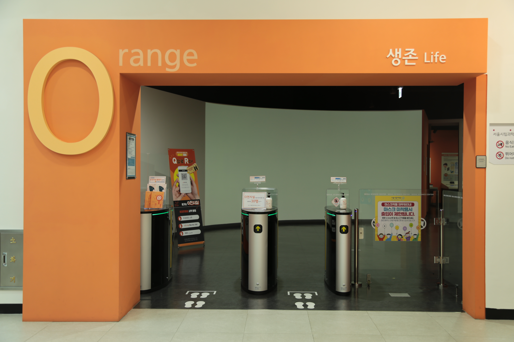

---
문서양식: 전시실 소개
전시실: O전시실
---

# 🏠 [홈](/)으로 가기
##
# O전시실(생존)

## 1. 전시실 소개
시간의 흐름에 따라 어린이의 일상 속 과학원리를 찾아보고 체험하는 공간입니다. 아침, 점심, 저녁 그리고 사계절 속에서 느낄 수 있는 과학을 경험해 보세요.

## 2. 전시물
### 2.1 전시물 배치도

  

  <a class="map-marker" style="left: 12.90%; top: 49.12%;" href="#/docs/halls/orange/O01" aria-label="O01 전시물 안내">1</a>
  <a class="map-marker" style="left: 16.80%; top: 26.80%;" href="#/docs/halls/orange/O02" aria-label="O02 전시물 안내">2</a>
  <a class="map-marker" style="left: 23.24%; top: 9.94%;" href="#/docs/halls/orange/O03" aria-label="O03 전시물 안내">3</a>
  <a class="map-marker" style="left: 27.54%; top: 9.93%;" href="#/docs/halls/orange/O04" aria-label="O04 전시물 안내">4</a>
  <a class="map-marker" style="left: 31.62%; top: 9.94%;" href="#/docs/halls/orange/O05" aria-label="O05 전시물 안내">5</a>
  <a class="map-marker" style="left: 36.16%; top: 9.91%;" href="#/docs/halls/orange/O06" aria-label="O06 전시물 안내">6</a>
  <a class="map-marker" style="left: 32.77%; top: 23.40%;" href="#/docs/halls/orange/O07" aria-label="O07 전시물 안내">7</a>
  <a class="map-marker" style="left: 32.69%; top: 50.58%;" href="#/docs/halls/orange/O08" aria-label="O08 전시물 안내">8</a>
  <a class="map-marker" style="left: 27.30%; top: 73.83%;" href="#/docs/halls/orange/O09" aria-label="O09 전시물 안내">9</a>
  <a class="map-marker" style="left: 36.92%; top: 72.92%;" href="#/docs/halls/orange/O10" aria-label="O10 전시물 안내">10</a>
  <a class="map-marker" style="left: 43.45%; top: 74.32%;" href="#/docs/halls/orange/O11" aria-label="O11 전시물 안내">11</a>
  <a class="map-marker" style="left: 45.38%; top: 48.12%;" href="#/docs/halls/orange/O12" aria-label="O12 전시물 안내">12</a>
  <a class="map-marker" style="left: 56.20%; top: 39.52%;" href="#/docs/halls/orange/O13" aria-label="O13 전시물 안내">13</a>
  <a class="map-marker" style="left: 55.73%; top: 71.49%;" href="#/docs/halls/orange/O14" aria-label="O14 전시물 안내">14</a>
  <a class="map-marker" style="left: 63.82%; top: 73.01%;" href="#/docs/halls/orange/O15" aria-label="O15 전시물 안내">15</a>
  <a class="map-marker" style="left: 68.46%; top: 72.80%;" href="#/docs/halls/orange/O16" aria-label="O16 전시물 안내">16</a>
  <a class="map-marker" style="left: 66.61%; top: 38.56%;" href="#/docs/halls/orange/O17" aria-label="O17 전시물 안내">17</a>
  <a class="map-marker" style="left: 66.56%; top: 20.55%;" href="#/docs/halls/orange/O18" aria-label="O18 전시물 안내">18</a>
  <a class="map-marker" style="left: 72.32%; top: 26.20%;" href="#/docs/halls/orange/O19" aria-label="O19 전시물 안내">19</a>
  <a class="map-marker" style="left: 73.02%; top: 9.94%;" href="#/docs/halls/orange/O20" aria-label="O20 전시물 안내">20</a>
  <a class="map-marker" style="left: 82.05%; top: 9.58%;" href="#/docs/halls/orange/O21" aria-label="O21 전시물 안내">21</a>
  <a class="map-marker" style="left: 79.73%; top: 42.33%;" href="#/docs/halls/orange/O22" aria-label="O22 전시물 안내">22</a>
  <a class="map-marker" style="left: 83.59%; top: 42.34%;" href="#/docs/halls/orange/O23" aria-label="O23 전시물 안내">23</a>
  <a class="map-marker" style="left: 74.35%; top: 74.37%;" href="#/docs/halls/orange/O24" aria-label="O24 전시물 안내">24</a>
  <a class="map-marker" style="left: 79.42%; top: 74.42%;" href="#/docs/halls/orange/O25" aria-label="O25 전시물 안내">25</a>
  <a class="map-marker" style="left: 83.57%; top: 74.35%;" href="#/docs/halls/orange/O26" aria-label="O26 전시물 안내">26</a>
  <a class="map-marker" style="left: 96.21%; top: 67.63%;" href="#/docs/halls/orange/O27" aria-label="O27 전시물 안내">27</a>
  <a class="map-marker" style="left: 90.03%; top: 42.31%;" href="#/docs/halls/orange/O28" aria-label="O28 전시물 안내">28</a>
  <a class="map-marker" style="left: 92.08%; top: 6.64%;" href="#/docs/halls/orange/O29" aria-label="O29 전시물 안내">29</a>
  <a class="map-marker" style="left: 95.95%; top: 10.47%;" href="#/docs/halls/orange/O30" aria-label="O30 전시물 안내">30</a>

### 2.2 전시물 리스트

  

    전시물 분류 기준
  

  

    <ul>관람형 : 전시 패널 및 영상물 등을 통해 정보를 제공하는 전시물</ul>
    <ul>체험형 : 버튼, 레버, 터치패널 및 아날로그 요소 등 인터렉션 요소가 있는 전시물</ul>
    <ul>실험탐구 : 전시물로 실험을 진행할 수 있으며, 이를 활용한 자발적 탐구를 권장하는 전시물</ul>
    <ul>게임형 : 게이밍적 체험요소가 있음</ul>
  

| 전시물 번호 | 전시물 명 | 분류 | 비고 |
| ------ | ------- | --- | --- |
| O01 | [모두의 서울](/docs/halls/orange/O01.md) | 관람형 |  |
| O02 | [실험실 거울의 비밀은?](/docs/halls/orange/O02.md) | 체험형 |  |
| O03 | [DNA 정보로 내가 누구인지 알 수 있을까?](/docs/halls/orange/O03.md) | 체험형 |  |
| O04 | [유전은 어떻게 일어나나?](/docs/halls/orange/O04.md) | 체험형 |  |
| O05 | [인체의 내외부 기관을 살펴보면? (1) 외부기관](/docs/halls/orange/O05.md) | 체험형/실험탐구 |  |
| O06 | [내 심장이 두근거리는 이유는?](/docs/halls/orange/O06.md) | 관람형 |  |
| O07 | [인체의 내외부 기관을 살펴보면? (2) 내부기관](/docs/halls/orange/O07.md) | 체험형 |  |
| O08 | [탄생부터 성장, 생애주기에 따른 신체 변화는? (1) 생애주기별 안내패널](/docs/halls/orange/O08.md) | 관람형 |  |
| O09 | [탄생부터 성장, 생애주기에 따른 신체 변화는? (2) 나의 과거와 미래](/docs/halls/orange/O09.md) | 체험형 |  |
| O10 | [유전자가 반반 섞이면 어떻게 될까? (1) 너반나반](/docs/halls/orange/O10.md) | 체험형 |  |
| O11 | [귀를 막아도 소리가 들릴까?](/docs/halls/orange/O11.md) | 체험형 |  |
| O12 | [유전자가 반반 섞이면 어떻게 될까? (2) 거울룰렛](/docs/halls/orange/O12.md) | 관람형 |  |
| O13 | [우리에게 금지된 것들, 왜 안된다고 하는 걸까?](/docs/halls/orange/O13.md) | 체험형/게임형 |  |
| O14 | [눈이 침침한 이유는?](/docs/halls/orange/O14.md) | 체험형 |  |
| O15 | [내 동공은 어떤 모습일까?](/docs/halls/orange/O15.md) | 체험형 |  |
| O16 | [내 눈에 보이는 색은 무엇일까?](/docs/halls/orange/O16.md) | 체험형 |  |
| O17 | [곤충과 쥐에 의한 질병의 감염 경로는?](/docs/halls/orange/O17.md) | 관람형 |  |
| O18 | [생물을 확대해서 보면 어떤 모습일까?](/docs/halls/orange/O18.md) | 체험형 |  |
| O19 | [인체에 질병을 일으키는 미생물은? (1) 현미경으로 보는 작은 세계](/docs/halls/orange/O19.md) | 체험형 |  |
| O20 | [인체에 질병을 일으키는 미생물은? (2) 단계별 연구실](/docs/halls/orange/O20.md) | 관람형 |  |
| O21 | [분자는 어떤 구조일까?](/docs/halls/orange/O21.md) | 체험형 |  |
| O22 | [탄소로 이루어진 세상은? (1) 탄소동소체 실물모형](/docs/halls/orange/O22.md) | 관람형 |  |
| O23 | [탄소로 이루어진 세상은? (2) 탄소인터렉티브](/docs/halls/orange/O23.md) | 체험형 |  |
| O24 | [내가 들을 수 있는 주파수는?](/docs/halls/orange/O24.md) | 체험형 |  |
| O25 | [주기율표에서 원소를 찾아보면?](/docs/halls/orange/O25.md) | 체험형 |  |
| O26 | [기체의 고유한 색을 관찰하면?](/docs/halls/orange/O26.md) | 체험형 |  |
| O27 | [철의 다양한 변신](/docs/halls/orange/O27.md) | 체험형 |  |
| O28 | [눈동자만으로 게임을 할 수 있을까?](/docs/halls/orange/O28.md) | 체험형/게임형 |  |
| O29 | [방출 스펙트럼 원소 주기율표](/docs/halls/orange/O29.md) | 관람형 |  |
| O30 | [방출 스펙트럼을 들어보면](/docs/halls/orange/O30.md) | 체험형 |  |

## 3. 전시실내 공간

## 변경기록
| 변경일 | 작성자 | 내용 및 사유 |
| ------ | ------ | ------------ |
|        |        |              |

