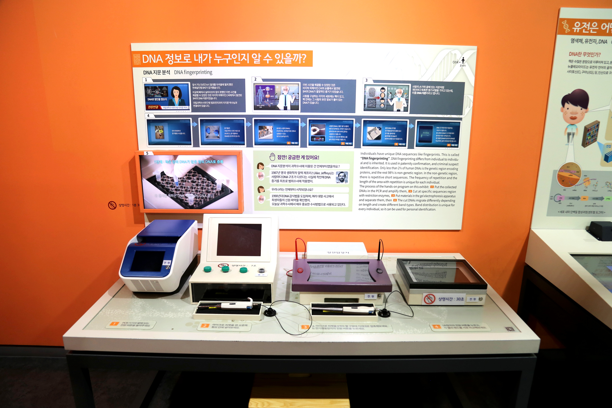

  <button class="nav-btn" onclick="goHome()">🏠 홈</button>
  <button class="nav-btn" onclick="goHall('orange')">🟠 Orange 전시실 개요</button>
  <button class="nav-btn" onclick="goBack()">⬅ 이전 페이지</button>

# O03 DNA 정보로 내가 누구인지 알 수 있을까?

## 1. 전시물 기본 내용
### 1.1 전시물 이미지

  
전시 목적

  

    사람마다 지문이 각각 다르듯이 DNA 배열 순서가 다르다는 것을 알고, 이를 통해서 개인 식별을 할 수 있음을 이해한다. DNA 지문 분석(DNA fingerprinting)의 과정을 모형과 영상 체험을 통해 자연스럽게 알아보고, 범인 찾기, 친자 확인 등에 활용되는 사례를 확인한다.
  

  
전시 유형 : 체험형

  

    DNA 지문분석 실험의 장비 모형을 통해 가상의 실험을 진행할 수 있는 전시물
  

### 1.2 학교 교육과정  
<!--
curriculum-table은 전시물과 연결된 학교 교육과정을 학년별로 비교하는 표이다.
내용체계 칸에는 정적 웹에 포함된 내부 교육과정 문서 링크를 넣는다.
챕터 및 단원명 칸에는 외부 교과서/교과 챕터 링크를 넣는다.
전시물과 연계성 칸에는 전시물에서 어떤 개념과 연결되는지 적는다.
비고 칸에는 학년별 수준 변화, 해설 시 유의점, 확인이 필요한 내용을 적는다.
-->

<table class="curriculum-table">
  <caption><b>학교 교육과정</b></caption>
  <thead>
    <tr>
      <th rowspan="2">교육과정 내용체계</th>
      <th colspan="2">해당 교과과정(교과서)</th>
      <th rowspan="2">전시물과 연계성</th>
      <th rowspan="2">비고</th>
    </tr>
    <tr>
      <th>학년 및 학기</th>
      <th>챕터 및 단원명</th>
    </tr>
  </thead>
  <tfoot>
    <tr>
      <td colspan="5">
        <ul>
          <li>교과챕터 및 단원명은 출판사의 교과서 pdf링크로 연결됩니다.</li>
          <li>고등2~3학년 과정은 선택교과입니다.</li>
        </ul>
      </td>
    </tr>
  </tfoot>
  <tbody>
    <tr>
          <td>
            <a class="curriculum-link-button" href="#/docs/school_curriculum/math/common/00_common_math_elementary1-2">
            초등학교 1~2학년 &gt; 변화와 관계 &gt; 규칙
            </a>
          </td>
          <td></td>
          <td></td>
          <td>DNA 지문 분석 개념 및 활용 사례 이해하기 활동 과정에서 수량 사이의 관계와 공간적 규칙을 찾아 수학적으로 표현하고 해석함</td>
          <td></td>
        </tr>
    <tr>
          <td>
            <a class="curriculum-link-button" href="#/docs/school_curriculum/math/common/00_common_math_elementary3-4">
            초등학교 3~4학년 &gt; 변화와 관계 &gt; 규칙
            </a>
          </td>
          <td></td>
          <td></td>
          <td>DNA 지문 분석 개념 및 활용 사례 이해하기 활동 과정에서 수량 사이의 관계와 공간적 규칙을 찾아 수학적으로 표현하고 해석함</td>
          <td></td>
        </tr>
    <tr>
          <td>
            <a class="curriculum-link-button" href="#/docs/school_curriculum/science/common/00_common_science_mid">
            중학교 1~3학년 &gt; 생식과 유전
            </a>
          </td>
          <td>중3</td>
          <td>(교과서 링크 없음)</td>
          <td>염색체와 유전자의 관계를 이해하고, 체세포분열과 생식세포 형성과정의 특징을 염색체 행동을 중심으로 해석하는 것을 학습함.</td>
          <td></td>
        </tr>
    <tr>
          <td>
            <a class="curriculum-link-button" href="#/docs/school_curriculum/science/01_integrated_science">
            통합과학1 &gt; 물질과 규칙성
            </a>
          </td>
          <td>고등1학년</td>
          <td><a class="curriculum-link-button external" href="https://ibook.vivasam.com/CBS_iBook/4506/contents/index.html?skin=basic01" target="_blank" rel="noopener">
                  II-2-03 지각과 생명체 구성물질의 규칙성 (22개정 비상교과서 통합과학1 pp 72-79)</a></td>
          <td>생명체를 구성하는 고분자 물질의 예시로 DNA가 쓰였음</td>
          <td></td>
        </tr>
    <tr>
          <td>
            <a class="curriculum-link-button" href="#/docs/school_curriculum/science/01_integrated_science">
            통합과학2 &gt; 과학과 미래 사회
            </a>
          </td>
          <td>고등1학년</td>
          <td><a class="curriculum-link-button external" href="https://ibook.vivasam.com/CBS_iBook/3784/contents/index.html?skin=basic01" target="_blank" rel="noopener">
                  III-1-01 과학의 유용성과 필요성 (22개정 비상교과서 통합과학2 pp 114-95)</a></td>
          <td>질병 연구 방법의 일환인 유전자증폭검사(PCR)의 예시가 있음</td>
          <td></td>
        </tr>
    <tr>
          <td>
            <a class="curriculum-link-button" href="#/docs/school_curriculum/science/01_integrated_science">
            통합과학1 &gt; 시스템과 상호작용
            </a>
          </td>
          <td>고등1학년</td>
          <td><a class="curriculum-link-button external" href="https://ibook.vivasam.com/CBS_iBook/4506/contents/index.html?skin=basic01" target="_blank" rel="noopener">
                  III-3-01 생명시스템과 화학반응 (22개정 비상교과서 통합과학1 pp 128-135)</a></td>
          <td>화학반응의 촉매로 작용하는 효소에 대해 학습</td>
          <td></td>
        </tr>
    <tr>
          <td>
            <a class="curriculum-link-button" href="#/docs/school_curriculum/science/01_integrated_science">
            통합과학1 &gt; 시스템과 상호작용
            </a>
          </td>
          <td>고등1학년</td>
          <td><a class="curriculum-link-button external" href="https://ibook.vivasam.com/CBS_iBook/4506/contents/index.html?skin=basic01" target="_blank" rel="noopener">
                  III-3-02 생명시스템에서 정보의 흐름 (22개정 비상교과서 통합과학1 pp 136-)</a></td>
          <td>DNA>RNA>단백질로 정보가 전달되는 생명중심원리(central dogma)학습</td>
          <td></td>
        </tr>
<tr>
  <td>
    <a class="curriculum-link-button" href="#/docs/school_curriculum/science/12_genetics">
    생물의 유전
    </a>
  </td>
  <td>고등2~3학년</td>
  <td><a class="curriculum-link-button external" href="https://ibook.vivasam.com/CBS_iBook/6667/contents/index.html?skin=basic01" target="_blank" rel="noopener">
      I-03 유전물질 (22개정 비상교과서 생물의 유전 pp 28-43)</a></td>
  <td>DNA의 복제과정에 대해 학습함</td>
  <td></td>
</tr>
  </tbody>
</table>

### 1.3 체험
##### 체험1) DNA 지문 분석 개념 및 활용 사례 이해하기
1. 패널을 통해 DNA 지문 분석에 대해 알아본다.

##### 체험2) DNA 지문 분석 과정 체험하기
1. PCR기기의 앞에 있는 전원버튼을 누른다.
2. 마이크로 피펫을 맨 오른쪽 튜브 안에 넣는다.
3. 마이크로 피펫을 네 개의 젤 구멍에 차례대로 접촉한다(짧게 터치!).
4. 전기영동장치의 전원버튼을 누른다.
5. UV장치의 전원버튼을 누르고, 각 열의 밴드를 서로 비교해본다.

### 1.4 패널내용

  

    DNA정보로 내가 누구인지 알 수 있을까?
  

  

    
  

  

    실험대 디자인
  

  

    
  

## 2. 기본 과학 이론
### 2.1 핵심 과학이론

<!--
data-theories에는 연결할 이론 문서의 제목을 입력한다.
쉼표(,)로 여러 이론을 구분할 수 있으며, assets/js/theory-links.js에 등록된 제목과 일치하면 버튼형 링크로 표시된다.
등록되지 않은 제목은 비활성 표시로 나타난다.
-->

### 2.2 연관 과학이론

## 3. 연관 전시물

<!--
related-exhibit-link-list는 연관 전시물 문서로 이동하는 버튼 목록이다.
a 태그의 href에는 연결할 전시물 문서 경로를 입력한다.
버튼을 여러 개 넣으면 세로로 정렬된다.

  <a class="related-exhibit-link-button" href="#/docs/halls/blue/B01">B01 세상은 어떻게 연결되어 있을까?</a>

-->

## 4. 기존 해설에서의 쓰임 예시

## 5. 확장 자료

### 심화 이론

<!--
resource-link-list는 확장 자료 링크를 세로로 정렬하는 목록이다.
내부 문서는 href에 #/docs/... 형식의 정적 웹 문서 경로를 입력한다.
버튼을 여러 개 넣으면 세로로 정렬된다.

  <a class="resource-link-button" href="#/docs/theory/zzz_incomplete">이론 양식 문서 보기</a>

-->

### 최신 연구

<!--
resource-link-list는 확장 자료 링크를 세로로 정렬하는 목록이다.
외부 자료는 href에 전체 URL을 입력하고 target="_blank" rel="noopener"를 함께 사용한다.
버튼을 여러 개 넣으면 세로로 정렬된다.

  <a class="resource-link-button external" href="https://www.google.com" target="_blank" rel="noopener">외부 연구 자료 보기</a>

-->

<!--
doc-tags는 문서에 해시태그를 표시하는 영역이다.
data-tags에 쉼표로 구분한 태그 이름을 입력한다.
태그 이름에는 #을 직접 붙이지 않는다.

-->

## 변경기록
| 변경일        | 작성자 | 내용 및 사유 |
| ---------- | --- | ------- |
| 2026.01.22 | 박은선 | 최초 작성   |
|            |     |         |

  <button class="nav-btn" onclick="goHome()">🏠 홈</button>
  <button class="nav-btn" onclick="goHall('orange')">🟠 Orange 전시실 개요</button>
  <button class="nav-btn" onclick="goBack()">⬅ 이전 페이지</button>

