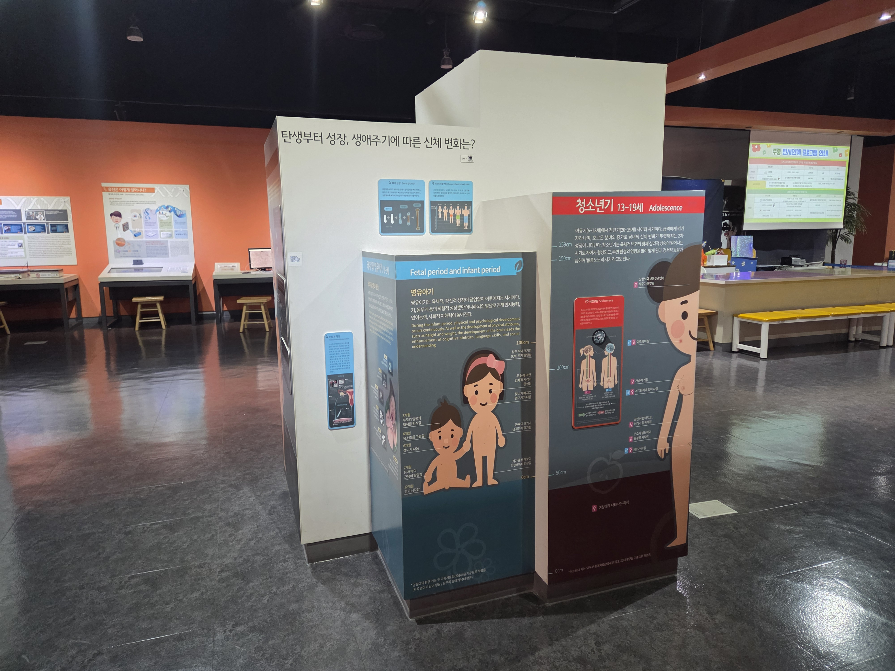

  <button class="nav-btn" onclick="goHome()">🏠 홈</button>
  <button class="nav-btn" onclick="goHall('orange')">🟠 Orange 전시실 개요</button>
  <button class="nav-btn" onclick="goBack()">⬅ 이전 페이지</button>

# O08 탄생부터 성장, 생애주기에 따른 신체 변화는? (1) 생애주기별 안내패널

## 1. 전시물 기본 내용
### 1.1 전시물 이미지

  
전시 목적

  

    수정부터 출생, 영유아기, 청소년기, 중년기, 노년기 등 인간의 생애 주기별 신체 내외부의 특징 및 변화를 알아본다.
  

  
전시 유형 : 관람형

  

    기둥형의 아날로그 패널로 구성된 전시물
  

### 1.2 학교 교육과정  
<!--
curriculum-table은 전시물과 연결된 학교 교육과정을 학년별로 비교하는 표이다.
내용체계 칸에는 정적 웹에 포함된 내부 교육과정 문서 링크를 넣는다.
챕터 및 단원명 칸에는 외부 교과서/교과 챕터 링크를 넣는다.
전시물과 연계성 칸에는 전시물에서 어떤 개념과 연결되는지 적는다.
비고 칸에는 학년별 수준 변화, 해설 시 유의점, 확인이 필요한 내용을 적는다.
-->

<table class="curriculum-table">
  <caption><b>학교 교육과정</b></caption>
  <thead>
    <tr>
      <th rowspan="2">교육과정 내용체계</th>
      <th colspan="2">해당 교과과정(교과서)</th>
      <th rowspan="2">전시물과 연계성</th>
      <th rowspan="2">비고</th>
    </tr>
    <tr>
      <th>학년 및 학기</th>
      <th>챕터 및 단원명</th>
    </tr>
  </thead>
  <tfoot>
    <tr>
      <td colspan="5">
        <ul>
          <li>교과챕터 및 단원명은 출판사의 교과서 pdf링크로 연결됩니다.</li>
          <li>고등2~3학년 과정은 선택교과입니다.</li>
        </ul>
      </td>
    </tr>
  </tfoot>
  <tbody>
  </tbody>
</table>

### 1.3 체험
##### 체험1) 생애주기별 신체 특징 알아보기
1. 생애주기 기둥에서 자신의 성별에 맞게 영유아기, 아동기, 청소년기, 중년기, 노년기에 벌어지는 대표적인 변화는 무엇이 있는지 알아본다.

### 1.4 패널내용

  

    전체 패널 디자인
  

  

    
  

  

    태아기와 영유아기-수정과 착상
  

  

    
  

  

    태아기와 영유아기-뼈의 성장
  

  

    
  

  

    태아기와 영유아기-머리의 비율 변화
  

  

    
  

  

    청소년기-성호르몬
  

  

    
  

  

    청소년기-성장호르몬
  

  

    
  

  

    중년기-피부의 노화
  

  

    
  

  

    중년기-성호르몬
  

  

    
  

  

    중년기-신진대사와 호르몬
  

  

    
  

  

    중년기-연령대별 사망 원인
  

  

    
  

  

    노년기-시력 감퇴
  

  

    
  

  

    노년기-청력 손실
  

  

    
  

  

    노년기-치아의 노화
  

  

    
  

  

    노년기-뇌의 퇴화
  

  

    
  

  

    노년기-골격과 근육의 변화
  

  

    
  

  

    노년기-죽음
  

  

    
  

## 2. 기본 과학 이론
### 2.1 핵심 과학이론

<!--
data-theories에는 연결할 이론 문서의 제목을 입력한다.
쉼표(,)로 여러 이론을 구분할 수 있으며, assets/js/theory-links.js에 등록된 제목과 일치하면 버튼형 링크로 표시된다.
등록되지 않은 제목은 비활성 표시로 나타난다.
-->

### 2.2 연관 과학이론

## 3. 연관 전시물

<!--
related-exhibit-link-list는 연관 전시물 문서로 이동하는 버튼 목록이다.
a 태그의 href에는 연결할 전시물 문서 경로를 입력한다.
버튼을 여러 개 넣으면 세로로 정렬된다.

  <a class="related-exhibit-link-button" href="#/docs/halls/blue/B01">B01 세상은 어떻게 연결되어 있을까?</a>

-->

## 4. 기존 해설에서의 쓰임 예시

## 5. 확장 자료

### 심화 이론

<!--
resource-link-list는 확장 자료 링크를 세로로 정렬하는 목록이다.
내부 문서는 href에 #/docs/... 형식의 정적 웹 문서 경로를 입력한다.
버튼을 여러 개 넣으면 세로로 정렬된다.

  <a class="resource-link-button" href="#/docs/theory/zzz_incomplete">이론 양식 문서 보기</a>

-->

### 최신 연구

<!--
resource-link-list는 확장 자료 링크를 세로로 정렬하는 목록이다.
외부 자료는 href에 전체 URL을 입력하고 target="_blank" rel="noopener"를 함께 사용한다.
버튼을 여러 개 넣으면 세로로 정렬된다.

  <a class="resource-link-button external" href="https://www.google.com" target="_blank" rel="noopener">외부 연구 자료 보기</a>

-->

<!--
doc-tags는 문서에 해시태그를 표시하는 영역이다.
data-tags에 쉼표로 구분한 태그 이름을 입력한다.
태그 이름에는 #을 직접 붙이지 않는다.

-->

## 변경기록
| 변경일        | 작성자 | 내용 및 사유 |
| ---------- | --- | ------- |
| 2026.01.22 | 박은선 | 최초 작성   |
|            |     |         |

  <button class="nav-btn" onclick="goHome()">🏠 홈</button>
  <button class="nav-btn" onclick="goHall('orange')">🟠 Orange 전시실 개요</button>
  <button class="nav-btn" onclick="goBack()">⬅ 이전 페이지</button>

