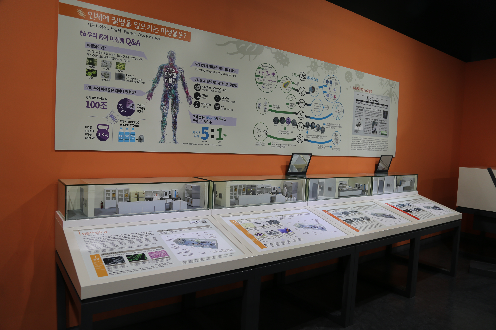

  <button class="nav-btn" onclick="goHome()">🏠 홈</button>
  <button class="nav-btn" onclick="goHall('orange')">🟠 Orange 전시실 개요</button>
  <button class="nav-btn" onclick="goBack()">⬅ 이전 페이지</button>

# O20 인체에 질병을 일으키는 미생물은? (2) 단계별 연구실

## 1. 전시물 기본 내용
### 1.1 전시물 이미지

  
전시 목적

  

    대표적인 병원성 미생물인 세균과 바이러스의 차이를 알아본다. 세균과 바이러스를 위험 정도에 따라 구분하고, 이를 취급하는 실험실 시설의 특징을 축소모형으로 살펴본다.
  

  
전시 유형 : 관람형

  

    아날로그 패널과 실험실 디오라마로 구성된 전시물
  

### 1.2 학교 교육과정  
<!--
curriculum-table은 전시물과 연결된 학교 교육과정을 학년별로 비교하는 표이다.
내용체계 칸에는 정적 웹에 포함된 내부 교육과정 문서 링크를 넣는다.
챕터 및 단원명 칸에는 외부 교과서/교과 챕터 링크를 넣는다.
전시물과 연계성 칸에는 전시물에서 어떤 개념과 연결되는지 적는다.
비고 칸에는 학년별 수준 변화, 해설 시 유의점, 확인이 필요한 내용을 적는다.
-->

<table class="curriculum-table">
  <caption><b>학교 교육과정</b></caption>
  <thead>
    <tr>
      <th rowspan="2">교육과정 내용체계</th>
      <th colspan="2">해당 교과과정(교과서)</th>
      <th rowspan="2">전시물과 연계성</th>
      <th rowspan="2">비고</th>
    </tr>
    <tr>
      <th>학년 및 학기</th>
      <th>챕터 및 단원명</th>
    </tr>
  </thead>
  <tfoot>
    <tr>
      <td colspan="5">
        <ul>
          <li>교과챕터 및 단원명은 출판사의 교과서 pdf링크로 연결됩니다.</li>
          <li>고등2~3학년 과정은 선택교과입니다.</li>
        </ul>
      </td>
    </tr>
  </tfoot>
  <tbody>
    <tr>
          <td>
            <a class="curriculum-link-button" href="#/docs/school_curriculum/science/common/00_common_science_elementry3-4">
            초등학교 3~4학년 &gt; 감염병과 건강한 생활
            </a>
          </td>
          <td>초등3-2</td>
          <td><a class="curriculum-link-button external" href="https://s3.ap-northeast-2.amazonaws.com/tsol.jihak.co.kr/tsol/22tp/e/sci/JIHAKSA_%EA%B3%BC%ED%95%99_%EC%B4%88_3-2_%EA%B5%90%EA%B3%BC%EC%84%9C.pdf" target="_blank" rel="noopener">
              4. 감염병과 건강한 생활 (22개정 지학사 과학 3-2 pp 88-99)</a></td>
          <td>세균과 바이러스의 차이 이해하기 활동 과정에서 생명체의 구조와 기능 및 생명 현상이 유지되는 원리를 이해함</td>
          <td>위생과 마스크 등 감염경로 차단에 대해서는 학습하나 미생물에 대한 내용은 학습하지 않음</td>
        </tr>
    <tr>
          <td>
            <a class="curriculum-link-button" href="#/docs/school_curriculum/science/common/00_common_science_elementry3-4">
            초등학교 3~4학년 &gt; 다양한 생물과 우리 생활
            </a>
          </td>
          <td>초등4-1</td>
          <td><a class="curriculum-link-button external" href="https://s3.ap-northeast-2.amazonaws.com/tsol.jihak.co.kr/tsol/22tp/e/sci/JIHAKSA_%EA%B3%BC%ED%95%99_%EC%B4%88_4-1_%EA%B5%90%EA%B3%BC%EC%84%9C.pdf" target="_blank" rel="noopener">
              4. 다양한 생물과 우리 생활 (22개정 지학사 과학 4-1 pp 102-113)</a></td>
          <td>세균과 바이러스의 차이 이해하기 활동 과정에서 생명체의 구조와 기능 및 생명 현상이 유지되는 원리를 이해함</td>
          <td></td>
        </tr>
    <tr>
          <td>
            <a class="curriculum-link-button" href="#/docs/school_curriculum/science/01_integrated_science">
            통합과학2 &gt; 과학과 미래 사회
            </a>
          </td>
          <td>고등1학년</td>
          <td><a class="curriculum-link-button external" href="https://ibook.vivasam.com/CBS_iBook/3784/contents/index.html?skin=basic01" target="_blank" rel="noopener">
                  III-1-01 과학의 유용성과 필요성 (22개정 비상교과서 통합과학2 pp 114-95)</a></td>
          <td>과학의 유용성의 예시로 감염병 진단 및 추적에 대한 학습이 있음</td>
          <td></td>
        </tr>
    <tr>
          <td>
            <a class="curriculum-link-button" href="#/docs/school_curriculum/science/01_integrated_science">
            통합과학1 &gt; 시스템과 상호작용
            </a>
          </td>
          <td>고등1학년</td>
          <td><a class="curriculum-link-button external" href="https://ibook.vivasam.com/CBS_iBook/4506/contents/index.html?skin=basic01" target="_blank" rel="noopener">
                  III-3-01 생명시스템과 화학반응 (22개정 비상교과서 통합과학1 pp 128-135)</a></td>
          <td>생물의 기본단위인 세포를 학습</td>
          <td></td>
        </tr>
    <tr>
          <td>
            <a class="curriculum-link-button" href="#/docs/school_curriculum/science/05_life_science">
            생명과학 &gt; 생명 시스템의 구성
            </a>
          </td>
          <td>고등2~3학년</td>
          <td><a class="curriculum-link-button external" href="https://ibook.vivasam.com/CBS_iBook/6645/contents/index.html?skin=basic01" target="_blank" rel="noopener">
                  I-1-01 생물과 생명과학의 특성 (22개정 비상교과서 생명과학 pp 13-19)</a></td>
          <td>생물과 비생물의 특징을 비교하고, 이를 바탕으로 세균과 바이러스의 차이를 학습함</td>
          <td></td>
        </tr>
    <tr>
          <td>
            <a class="curriculum-link-button" href="#/docs/school_curriculum/science/05_life_science">
            생명과학 &gt; 항상성과 몸의 조절
            </a>
          </td>
          <td>고등2~3학년</td>
          <td><a class="curriculum-link-button external" href="https://ibook.vivasam.com/CBS_iBook/6652/contents/index.html?skin=basic01" target="_blank" rel="noopener">
                  II-2 인체의 면역반응 (22개정 비상교과서 생명과학 pp 109-139)</a></td>
          <td>감염성 질병과 인체의 반응에 대해 학습함</td>
          <td></td>
        </tr>
<tr>
  <td>
    <a class="curriculum-link-button" href="#/docs/school_curriculum/science/11_cell_and_metabolism">
    세포와 물질대사 &gt; 세포
    </a>
  </td>
  <td>고등2~3학년</td>
  <td><a class="curriculum-link-button external" href="https://ibook.vivasam.com/CBS_iBook/6668/contents/index.html?skin=basic01" target="_blank" rel="noopener">
      I 세포 (22개정 비상교과서 세포와 물질대사 pp 11-49)</a></td>
  <td>생물의 구성단위인 세포와 그 세포의 구조 및 기능에 대해 학습.</td>
  <td></td>
</tr>
<tr>
  <td>
    <a class="curriculum-link-button" href="#/docs/school_curriculum/science/15_history_and_culture_of_science">
    과학의 역사와 문화
    </a>
  </td>
  <td>고등2~3학년</td>
  <td><a class="curriculum-link-button external" href="https://ibook.vivasam.com/CBS_iBook/6657/contents/index.html?skin=basic01" target="_blank" rel="noopener">
      II-04 감염병과 과학 (22개정 비상교과서 과학의 역사와 문화 pp 110-121)</a></td>
  <td>감염병의 원인 규명과 예방 방법에 대한 내용이 있음</td>
  <td></td>
</tr>
  </tbody>
</table>

### 1.3 체험
##### 체험1) 세균과 바이러스의 차이 이해하기
1. 벽에 부착된 패널을 보며 세균과 바이러스의 차이점을 알아본다.
2. 우리에게 해로운 미생물과 우리가 유용하게 쓰는 미생물들을 알아본다.

##### 체험2) 생물안전등급에 따른 실험실 시설과 병원체 분류 알아보기
1. 패널을 통해 생물안전등급의 기준을 확인한다.
2. 실험실 축소 모형을 통해 각 생물 안전등급에 따라 실험실에서 변화한 안전장비를 확인한다.

### 1.4 패널내용

  

    인체에 질병을 일으키는 미생물은?
  

  

    
  

  

    생물안전등급 1등급
  

  

    
  

  

    생물안전등급 2등급
  

  

    
  

  

    생물안전등급 3등급
  

  

    
  

  

    생물안전등급 4등급
  

  

    
  

## 2. 기본 과학 이론
### 2.1 핵심 과학이론

<!--
data-theories에는 연결할 이론 문서의 제목을 입력한다.
쉼표(,)로 여러 이론을 구분할 수 있으며, assets/js/theory-links.js에 등록된 제목과 일치하면 버튼형 링크로 표시된다.
등록되지 않은 제목은 비활성 표시로 나타난다.
-->

### 2.2 연관 과학이론

## 3. 연관 전시물

<!--
related-exhibit-link-list는 연관 전시물 문서로 이동하는 버튼 목록이다.
a 태그의 href에는 연결할 전시물 문서 경로를 입력한다.
버튼을 여러 개 넣으면 세로로 정렬된다.

  <a class="related-exhibit-link-button" href="#/docs/halls/blue/B01">B01 세상은 어떻게 연결되어 있을까?</a>

-->

## 4. 기존 해설에서의 쓰임 예시

## 5. 확장 자료

### 심화 이론

<!--
resource-link-list는 확장 자료 링크를 세로로 정렬하는 목록이다.
내부 문서는 href에 #/docs/... 형식의 정적 웹 문서 경로를 입력한다.
버튼을 여러 개 넣으면 세로로 정렬된다.

  <a class="resource-link-button" href="#/docs/theory/zzz_incomplete">이론 양식 문서 보기</a>

-->

### 최신 연구

<!--
resource-link-list는 확장 자료 링크를 세로로 정렬하는 목록이다.
외부 자료는 href에 전체 URL을 입력하고 target="_blank" rel="noopener"를 함께 사용한다.
버튼을 여러 개 넣으면 세로로 정렬된다.

  <a class="resource-link-button external" href="https://www.google.com" target="_blank" rel="noopener">외부 연구 자료 보기</a>

-->

<!--
doc-tags는 문서에 해시태그를 표시하는 영역이다.
data-tags에 쉼표로 구분한 태그 이름을 입력한다.
태그 이름에는 #을 직접 붙이지 않는다.

-->

## 변경기록
| 변경일        | 작성자 | 내용 및 사유 |
| ---------- | --- | ------- |
| 2026.01.22 | 박은선 | 최초 작성   |
|            |     |         |

  <button class="nav-btn" onclick="goHome()">🏠 홈</button>
  <button class="nav-btn" onclick="goHall('orange')">🟠 Orange 전시실 개요</button>
  <button class="nav-btn" onclick="goBack()">⬅ 이전 페이지</button>

