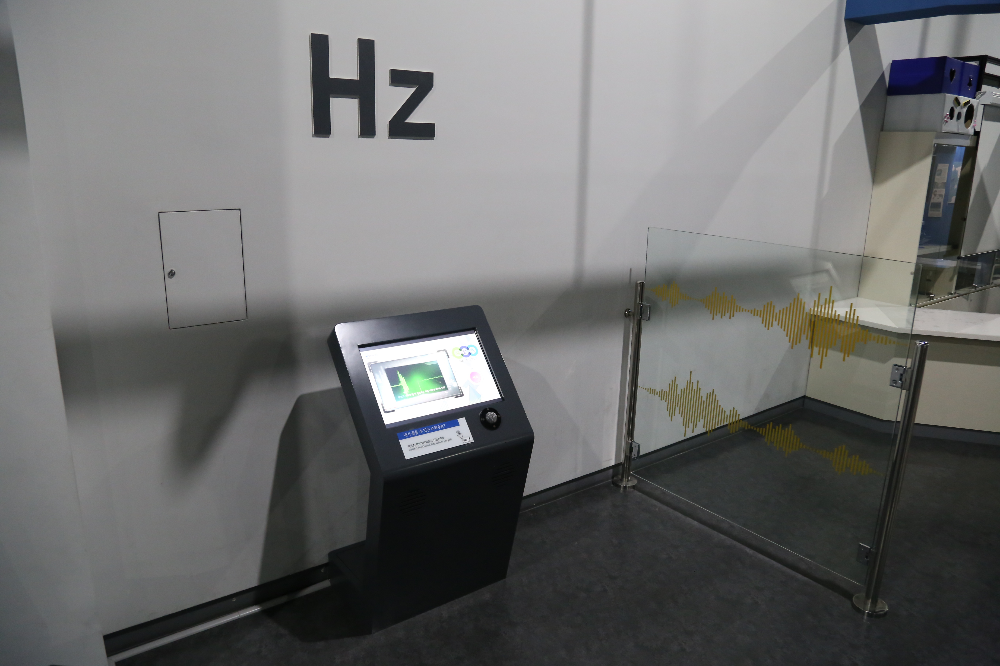

  <button class="nav-btn" onclick="goHome()">🏠 홈</button>
  <button class="nav-btn" onclick="goHall('orange')">🟠 Orange 전시실 개요</button>
  <button class="nav-btn" onclick="goBack()">⬅ 이전 페이지</button>

# O24 내가 들을 수 있는 주파수는?

## 1. 전시물 기본 내용
### 1.1 전시물 이미지
 

  
전시 목적

  

    사물의 소리를 이루는 주파수(파장)의 단위인 헤르츠(Hz)의 기준과 개념을 이해하고 디지털 장치를 이용해 가청 능력과 음계 인지능력을 테스트해본다.
  

  
전시 유형 : 체험형

  

    아날로그 패널과 터치 모니터로 구성된 전시물
  

### 1.2 학교 교육과정  
<!--
curriculum-table은 전시물과 연결된 학교 교육과정을 학년별로 비교하는 표이다.
내용체계 칸에는 정적 웹에 포함된 내부 교육과정 문서 링크를 넣는다.
챕터 및 단원명 칸에는 외부 교과서/교과 챕터 링크를 넣는다.
전시물과 연계성 칸에는 전시물에서 어떤 개념과 연결되는지 적는다.
비고 칸에는 학년별 수준 변화, 해설 시 유의점, 확인이 필요한 내용을 적는다.
-->

<table class="curriculum-table">
  <caption><b>학교 교육과정</b></caption>
  <thead>
    <tr>
      <th rowspan="2">교육과정 내용체계</th>
      <th colspan="2">해당 교과과정(교과서)</th>
      <th rowspan="2">전시물과 연계성</th>
      <th rowspan="2">비고</th>
    </tr>
    <tr>
      <th>학년 및 학기</th>
      <th>챕터 및 단원명</th>
    </tr>
  </thead>
  <tfoot>
    <tr>
      <td colspan="5">
        <ul>
          <li>교과챕터 및 단원명은 출판사의 교과서 pdf링크로 연결됩니다.</li>
          <li>고등2~3학년 과정은 선택교과입니다.</li>
        </ul>
      </td>
    </tr>
  </tfoot>
  <tbody>
    <tr>
          <td>
            <a class="curriculum-link-button" href="#/docs/school_curriculum/science/common/00_common_science_elementry3-4">
              초등학교 3~4학년 &gt; 소리의 성질
            </a>
          </td>
          <td>초등3-2</td>
          <td><a class="curriculum-link-button external" href="https://s3.ap-northeast-2.amazonaws.com/tsol.jihak.co.kr/tsol/22tp/e/sci/JIHAKSA_%EA%B3%BC%ED%95%99_%EC%B4%88_3-2_%EA%B5%90%EA%B3%BC%EC%84%9C.pdf" target="_blank" rel="noopener">
              3. 소리의 성질 (22개정 지학사 과학 3-2 pp 64-77)</a></td>
          <td>내 목소리를 고음과 저음으로 바꿔보기 활동 과정에서 진동과 파동이 발생하고 전달되는 특성을 관찰하고 이해함</td>
          <td></td>
        </tr>
    <tr>
          <td>
            <a class="curriculum-link-button" href="#/docs/school_curriculum/science/common/00_common_science_mid">
            중학교 1~3학년 &gt; 빛과 파동
            </a>
          </td>
          <td>중등2학년</td>
          <td><a class="curriculum-link-button external" href="https://ibook.vivasam.com/CBS_iBook/10777/contents/index.html?skin=basic01" target="_blank" rel="noopener">
              III-2-02 파동으로 알아보는 소리의 특성 (22개정 비상교과서 중등2 pp 116-120)</a></td>
          <td>소리의 3요소(진폭, 진동수, 파형)를 알아볼 수 있음</td>
          <td></td>
        </tr>
  </tbody>
</table>

### 1.3 체험
##### 체험1) 내 목소리를 고음과 저음으로 바꿔보기
1. 영상 시청 후 시작 버튼을 누른 후 음성 변조 버튼을 누른다.
2. 녹음 버튼을 누른다.
3. 마이크에 입을 가까이하고 자신의 목소리를 녹음한다.
4. 녹음이 끝나면 정지 버튼을 누른다.
5. 다음 버튼을 누르고 다양한 음역대로 목소리를 바꿔본다.
6. 다른 체험을 하고 싶다면 화면 상단에서 선택한다.

##### 체험2) 내가 들을 수 있는 주파수를 확인하여 청력 나이 테스트하기
1. 영상 시청 후 시작 버튼을 누른 후 청력 나이 버튼을 누른다.
2. 측정하고 싶은 단계별 (1~9단계) 버튼을 누른다.
3. 다양한 영역대의 주파수 음이 재생된다.
4. 음이 들리는 횟수를 선택한다(0~5번).
5. 다른 단계 버튼을 계속 눌러 다양한 영역대의 주파수 음을 확인해본다.
6. 다른 체험을 하고 싶다면 화면 상단에서 선택한다.
7. 내가 들을 수 있는 주파수를 확인하여 청력나이 테스트하기

##### 체험3) 피아노 소리를 듣고 어떤 음계인지 맞춰보기
1. 영상 시청 후 시작 버튼을 누른 후 절대 음감 버튼을 누른다.
2. 피아노 각 음계를 먼저 들어보고 측정하기 버튼을 누른다.
3. 소리 듣기 버튼을 눌러 나오는 피아노 음을 들어보고 맞는 음계의 건반을 누른다.
4. 5번의 기회가 주어지며 측정이 끝난 후 정확도를 확인한다.
5. 다른 체험을 하고 싶다면 화면 상단에서 선택한다.

### 1.4 패널내용

  

    내가 들을 수 있는 주파수는?
  

  

    
  

## 2. 기본 과학 이론
### 2.1 핵심 과학이론

<!--
data-theories에는 연결할 이론 문서의 제목을 입력한다.
쉼표(,)로 여러 이론을 구분할 수 있으며, assets/js/theory-links.js에 등록된 제목과 일치하면 버튼형 링크로 표시된다.
등록되지 않은 제목은 비활성 표시로 나타난다.
-->

### 2.2 연관 과학이론

## 3. 연관 전시물

<!--
related-exhibit-link-list는 연관 전시물 문서로 이동하는 버튼 목록이다.
a 태그의 href에는 연결할 전시물 문서 경로를 입력한다.
버튼을 여러 개 넣으면 세로로 정렬된다.

  <a class="related-exhibit-link-button" href="#/docs/halls/blue/B01">B01 세상은 어떻게 연결되어 있을까?</a>

-->

## 4. 기존 해설에서의 쓰임 예시

## 5. 확장 자료

### 심화 이론

<!--
resource-link-list는 확장 자료 링크를 세로로 정렬하는 목록이다.
내부 문서는 href에 #/docs/... 형식의 정적 웹 문서 경로를 입력한다.
버튼을 여러 개 넣으면 세로로 정렬된다.

  <a class="resource-link-button" href="#/docs/theory/zzz_incomplete">이론 양식 문서 보기</a>

-->

### 최신 연구

<!--
resource-link-list는 확장 자료 링크를 세로로 정렬하는 목록이다.
외부 자료는 href에 전체 URL을 입력하고 target="_blank" rel="noopener"를 함께 사용한다.
버튼을 여러 개 넣으면 세로로 정렬된다.

  <a class="resource-link-button external" href="https://www.google.com" target="_blank" rel="noopener">외부 연구 자료 보기</a>

-->

<!--
doc-tags는 문서에 해시태그를 표시하는 영역이다.
data-tags에 쉼표로 구분한 태그 이름을 입력한다.
태그 이름에는 #을 직접 붙이지 않는다.

-->

## 변경기록
| 변경일        | 작성자 | 내용 및 사유 |
| ---------- | --- | ------- |
| 2026.01.22 | 박은선 | 최초 작성   |
|            |     |         |

  <button class="nav-btn" onclick="goHome()">🏠 홈</button>
  <button class="nav-btn" onclick="goHall('orange')">🟠 Orange 전시실 개요</button>
  <button class="nav-btn" onclick="goBack()">⬅ 이전 페이지</button>

